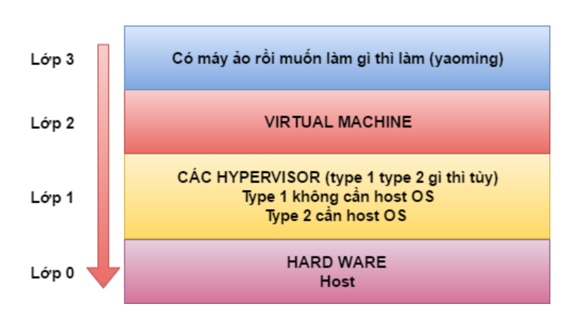

# Miêu tả Vitualization

Ảo hóa là một công nghệ ra đời nhằm khai thác triệt để khả năng làm việc cua các phần cứng trong một hệ thống máy chủ. Nó hoạt động như một tầng trung gian giữa hệ thống phần cứng máy tính và phần mềm chạy trên nó. Ý tưởng của công nghệ ảo hóa máy chủ là một máy vật lý đơn lẻ có thể tạo nhiều máy chủ ảo đơn lẻ độc lập. Ảo hóa cho phép tạo ra nhiều máy ảo trên một máy chủ vật lý, mỗi một máy ảo cũng được cấp phát tài nguyên phần cứng như một máy thật gồm có RAM, CPU, Card mạng, ổ cứng, các tài nguyên khác và hệ điều hành riêng biệt. Khi chạy ứng dụng, người sử dụng không nhận biết được ứng dụng đó chạy trên lớp phần cứng nào.

Các thành phần cấu hình của một hệ thống ảo hóa như sau:

Tuy nhiên, cần lưu ý một vài Hypervisor chỉ hỗ trợ một số OS hệ điều hành

