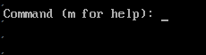
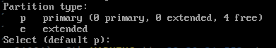

# Note Overview Virtualization và Hypervisor
https://www.thegioimaychu.vn/blog/ao-hoa/huong-dan-tong-quan-ve-ao-hoa-vmware-p3588/

1. [Virtualization là gì?](#1)
2. [Tại sao lên sử dụng công nghệ ảo hóa](#whyuse)
3. [Hypervisor là gì?](#Hypervisor)
4. [Vitual Machine là gì?](#Machine)
5. [Hypervisor/VMM là gì?](#Hypervisor)

[Hypervisor hoạt động như thế nào](Hypervisor-active.md)
 [**Loại 1**: Native](#Native)

 [**Loại 2**: Hosted](#Hosted)

6. [Ring](#Ring)
7. [Phân lại Virtualization](#Virtualizationc)

### Virtualization là gì?
Virtualization, hay còn gọi là ảo hóa, là một công nghệ thiết kế  để tạo ra phần trung gian giữa hệ thống và phần cứng máy tính và phần mềm chạy trên nó. Ý tưởng của công nghệ ảo hóa máy chủ là từ một máy vật lý đơn giản tạo ra nhiều máy ảo độc lập. Mỗi máy ảo đều có thiết lập nguồn hệ thống riêng biệt, hệ điều hành riêng và ứng ụng riêng. Ảo hóa có nguồn gốc từ việc phân chia ổ đĩa, chúng chia một máy chủ thực thành nhiều máy chủ logic. Một khi máy chủ thực được chia, mỗi máy chủ logic có thể chạy một hệ điều hành và các ứng dụng độc lập.

>**Ý nghĩa**: ẢO HÓA LÀ PHƯƠNG PHÁP ĐỂ TẠO RA PHIÊN BẢN ẢO HÓA TRÊN MÁY TÍNH VẬT LÝ.

### Tại sao lên sử dụng công nghệ ảo hóa

Tiết kiệm chi phí và tối ưu hóa hạ tầng CNTT là điều các doanh nghiệp quan tâm, đặc biệt là các doanh nghiệp có nhiều chi nhánh trên cả nước hay toàn cầu. Ảo hóa giúp doanh nghiệp nâng cao năng lực bảo mật dữ liệu, tăng cường khả năng khôi phục sau thảm họa, nâng cao tính linh hoạt và cắt giảm chi phí đầu tư cho CNTT như phải cập nhật liên tục phần mềm, các tính năng mới... trên nhiều máy vật lý.

### Hypervisor/VMM(Virtual Machine Monitor) là gì?

Hypervisor hay còn gọi là phần mềm giám sát máy ảo: là một chương trình phần mềm quản lý môt hoặc nhiều máy ảo VM. Nó được sử dụng để tạo, Startup, Suspend và reset lại các máy ảo. Các Hypervisor cho phép mỗi VM hoặc "Guest" truy cập vào phần cứng vật lý bên dưới, Chẳng hạn như CPU, RAM, Disk. Nó cũng có thể giới hạn tài nguyên hệ thống mà mỗi máy ảo có thể dụng để đảm bỏa  cho nhiều máy ảo cùng sử dụng đồng thời trên một hệ thống.
>**Ý nghĩa**: Hypervisor là các phần mềm công nghệ để tạo máy ảo và giám sát, điều khiển máy ảo. Muốn Ảo Hóa thì cài Hypervisor nào đó.

### Loại 1: Native

Một Hypervisor ở dạng native (hay còn gọi là "bare-metal") chạy trực tiếp trên phần cứng. nó nằm giữa phần cứng và một hệ điều hành khách (Guest Operating System). Nó được khởi động trước hệ điều hành và tương tác trực tiếp với kernel. Điều này mang lại hiệu suất cao nhất có thể vì không có hệ điều hành chính nào cạnh tranh tài nguyên máy tính với nó. Tuy nhiên, nó có thể đồng nghĩa với việc hệ thống chỉ có thể sử dụng để chạy các máy ảo vì Hypervisor luôn phải chạy ngầm bên dưới.

Các Hypervisor dạng Native này có hteer kể như VMware ESXi, Microsoft Hyper-V và Apple boot Camp.

### Loại 2: Hosted

Một Hypervisor dạng Hosted được cài đặt trên một máy tính chủ (host computer)
, mà trong đó có một hệ điều hành đã được cài đặt. Nó chạy như một ứng dụng cũng như các phần mềm khác trên máy tính. Hầu hết các Hypervisor dạng hosted có thể quản lý và chạy nhiều máy ảo cùng một lúc. Lợi thế của một Hypervisor hosted là có thể được bật lên hoặc thoát ra khi cần thiết, giải phóng tài nguyên cho máy chủ. Tuy nhiên, vì chạy trên một hệ điều hành, nó có thể đem lại hiệu suất tương tự như một Hypervisor ở dạng Native.

Ví dụ về các Hypervisor dạng hosted bao gồm VMwaware Workstation, Oracle VirtualBox và Parallels Desktop for Mac.

Khác biệt giữa 2 loại là:
* Native: được cài đặt làm OS trực tiếp để tạo VM
* Hosted: Hypervisor được cài sau một hệ điều hành làm nền. Đứng giữa OS và VM

### Vitual Machine là gì?
Virtual Machine-VM hay còn gọi là máy ảo, là một môi trường hoạt động độc lập - phần mềm hoạt động cùng nhưng độc lập với hệ điều hành máy chủ

## Ring

Trong khoa học máy tính, **Hierarchical Protection Domains** (Miền bảo vệ phân cấp) hay Protection Rings là cơ chế nhằm bảo vệ dữ liệu và chức năng của một chương chình tránh khỏi nguy cơ lỗi hoặc bị truy cập trái phép bởi các chương trình khác.

Một **Protection Ring** là một mức độ (module/level/layer) truy cập tài nguyên hệ thống. Số lượng Ring tùy thuộc vào kiến trúc CPU và hệ điều hành chạy trên kiến trúc đó có khả năng hỗ trợ bao nhiêu Ring.

Các Ring được sắp xếp có thứ bậc, từ mức có nhiều đặc quyền nhất (dành cho Trusted-Software, thường được đánh số 0) đến mức có ít đặc quyền nhất (dành cho unTrusted-Software, được đánh số cao nhất).

Dưới đây là hình minh họa các Ring trong kiến trúc CPU [X86](x86.md)

* **Ring 0**: Các trương trình hoạt động tại Ring 0 có đặc quyền cao nhất, có thể tương tác trực tiếp với phần cứng như CPU, Memory...

Để cho phép các ứng dụng nằm ở Ring có trọng số cao truy cập các tài nguyên được quản lý bởi các chương trình nằm ở Ring có trọng số thấp hơn, họ xây dựng các cổng (gate) đặc biệt. Ví dụ system call (lời gọi hàm hệ thống) giữa các ring.

Việc quy định chặt chẽ chương trình nào nằm tại ring nào cộng với việc xây dựng các cổng phù hợp giữa các ring sẽ đảm bảo tính ổn định của hệ thống, đồng thời ngăn chặn các chương trình nằm trong Ring cao sử dụng trái phép (do cố tình hoặc cố ý) các tài nguyên dành cho các chương trình khác nằm tại ring thấy hơn

Ví dụ: một ứng dụng đang chạy với tư cách là ứng dụng cho người dùng thông thường (Thuộc unTrusted-Software) nằm tại ring 3 có ý định bật webcam mà không được sự đồng ý của người dùng. Hành vi này sẽ được hệ thống ngăn chặn vì muốn truy cập tới phần cứng là thiết bị webcam nó phải sử dụng một hàm phần mềm điều khiển thiết bị (device Driver) của webcam (thuộc Trusted_software) nằm tại Ring 1

Hầu hết các hệ điều hành chỉ sử dụng 2 ring ngay cả khi phần cứng mà hệ điều hành chạy trên đó hỗ trợ nhiều hơn 2 ring. Ví dụ, Window chỉ cho sử dụng 2 mức là Ring 0 (tương ứng kernel Module) và ring 3( tương ứng với User mode).

>**Ý nghĩa**: Ring cách ly người dùng với hệ điều hành bằng các cấp đặc quyền.

## Phân lại Virtualization

Trong ảo hóa, Người ta có thể ảo:

* RAM Virtualization
* CPU Virtualization
* Network Virtualization
* Device I/O Virtualization

## CPU Virtualization

Có 4 loại CPU Virtualization:

* Full Virtualization
* Para Virtualization 
* Container-based Virtualization
* Hardware Assisted Virtualization
* OS level Virtualization
* Hybrid Virtualization: (Hardware Virtualization with pv Drivers)

### Full Virtualization 

Trong giải pháp này, Các Non-virtualizable intruction từ guest OS được translate qua Binary translation ở Virtualization layer và cache lại kết quả dùng cho các lần sau. Còn user level Application thì thực hiện direct execution xuyên qua Virtualization layer. Bằng cách này, trở ngại các chỉ thị guest OS không hoạt động ở ring khác 0bij vượt qua còn các user level Application vẫn hoạt động ở Native Speed (Tốc độ đáp ứng yêu cầu giống như khi không có ảo hóa). Guest OS hoàn toàn không nhận ra nó đang nằm trên một lớp ảo hóa vì các Low-level request không có gì thay đổi. Do đó Guest OS hoàn toàn không phải chỉnh sửa gì.

## Các thành phần của một hệ thống ảo hóa

* Tài nguyên vật lý chính: Máy chủ vật lý, CPU, RAM, Ổ đĩa cứng, Card mạng.. Nhiệm vụ là chia tài nguyên cấp cho các máy ảo.
* Phần mềm ảo hóa(Hypervisor): Cung cấp truy cập cho mỗi máy chủ ảo đến tài nguyên của máy chủ vật lý, Lập kế hoạch phân chia tài nguyên của máy chủ vật lý cho các máy chủ ảo.
* Hệ điều hành Khách(Guest Operating System): được cài đặt trên một máy chủ ảo, thao tác như ở trên hệ điều hành thông thường.
* Máy ảo(Virtual machine): Nó hoạt động như một máy chủ vật lý thông thường với tài nguyên riêng, giao diện riêng, hệ điều hành riêng.

Một hệ thống ảo hóa bắt buộc phải có đầy đủ các thành phần: tài nguyên vật lý, phần mềm ảo hóa, máy chủ ảo và hệ điều hành khách. Khi có đầy đủ 4 thành phần của hệ thống ảo hóa, máy chủ ảo và hệ điều hành khách. Khi có đầy đủ 4 thành phần của hệ thống ảo hóa, người dùng có thể dễ dàng xây dựng cho mình một hệ thống ứng dụng ảo hóa hoàn chỉnh

## Ảo hóa hoạt động như thế nào?

Ảo hóa được xay dựng dựa trên giải pháp chia 1 máy vật lý thành nhiều máy VM. Virtual Machine Monitor (VMM) hay còn được gọi là Hypervisor -  Cho phép tạo tách rời các máy ảo và điều phối truy cập của các máy ảo này đến tài nguyên phần cứng và cấp phát tài nguyên tự động theo nhu cầu sử dụng.
* Nhiều ứng dụng chạy trên 1 server, mỗi VM được lập trình trên máy chủ, do đó nhiều ứng dụng và các hệ diều hành có thể cùng lúc chạy trên host.
* Tối đa hóa công suất sử dụng và tối thiểu hóa server: mỗi máy chủ vật lý đươc sự dụng với đầy đủ công suất, cho phép giảm đáng kể chi phí nhờ sử dụng tối đa server.
* Cấp phát tài nguyên và ứng dụng nhanh chóng, dễ dàng. VM được triển khai từ một file chứa đầy đủ phần mềm với cơ chế đơn giản là copy và mang điều này đến sự giản đơn, nhanh chóng và linh hoạt chưa từng có cho việc quản lý và cung cấp hạ tầng công nghệ thông tin. Máy ảo thậm chí có thể di chuyển sang một server vật lý khác trong khi vẫn đang chạy, Hoạt động bình thường. Doanh nghiệp có thể ảo hóa những ứng dụng quan trọng của doanh nghiệp để nâng cao hiệu suất, sự ổn định, khả năng mở rộng và giảm thiểu chi phí.