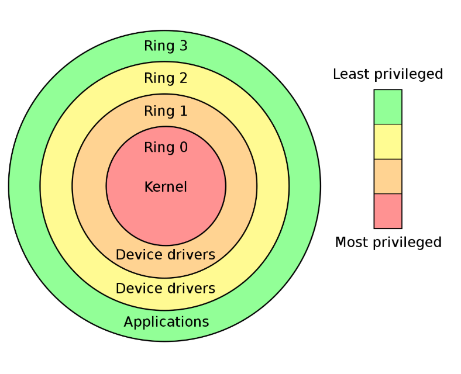
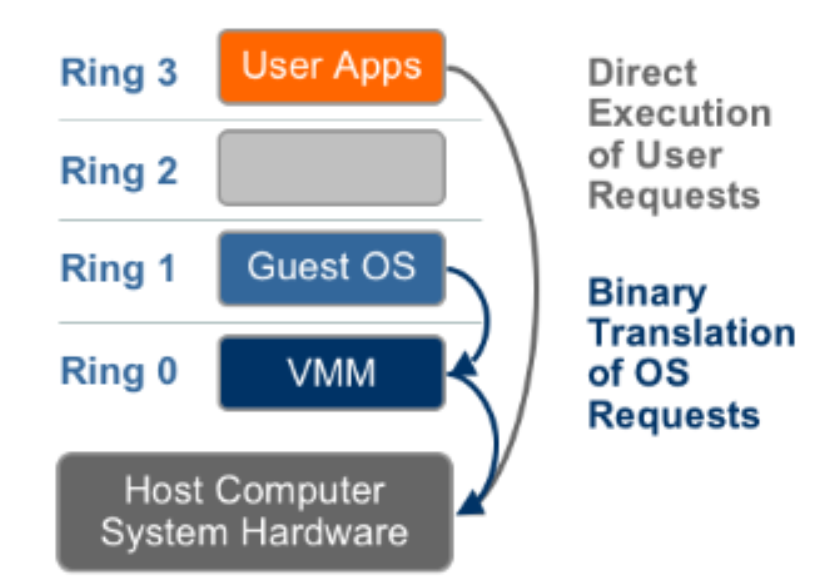

# Ring và phân loại ảo áo

. [Ring](#Ring)
. [Phân lại Virtualization](#Virtualizationc)

## Ring

Trong khoa học máy tính, **Hierarchical Protection Domains** (Miền bảo vệ phân cấp) hay Protection Rings là cơ chế nhằm bảo vệ dữ liệu và chức năng của một chương chình tránh khỏi nguy cơ lỗi hoặc bị truy cập trái phép bởi các chương trình khác.

Một **Protection Ring** là một mức độ (module/level/layer) truy cập tài nguyên hệ thống. Số lượng Ring tùy thuộc vào kiến trúc CPU và hệ điều hành chạy trên kiến trúc đó có khả năng hỗ trợ bao nhiêu Ring.

Các Ring được sắp xếp có thứ bậc, từ mức có nhiều đặc quyền nhất (dành cho Trusted-Software, thường được đánh số 0) đến mức có ít đặc quyền nhất (dành cho unTrusted-Software, được đánh số cao nhất).

Dưới đây là hình minh họa các Ring trong kiến trúc CPU [X86](x86.md)

* **Ring 0**: Các trương trình hoạt động tại Ring 0 có đặc quyền cao nhất, có thể tương tác trực tiếp với phần cứng như CPU, Memory...

Để cho phép các ứng dụng nằm ở Ring có trọng số cao truy cập các tài nguyên được quản lý bởi các chương trình nằm ở Ring có trọng số thấp hơn, họ xây dựng các cổng (gate) đặc biệt. Ví dụ system call (lời gọi hàm hệ thống) giữa các ring.

Việc quy định chặt chẽ chương trình nào nằm tại ring nào cộng với việc xây dựng các cổng phù hợp giữa các ring sẽ đảm bảo tính ổn định của hệ thống, đồng thời ngăn chặn các chương trình nằm trong Ring cao sử dụng trái phép (do cố tình hoặc cố ý) các tài nguyên dành cho các chương trình khác nằm tại ring thấy hơn

Ví dụ: một ứng dụng đang chạy với tư cách là ứng dụng cho người dùng thông thường (Thuộc unTrusted-Software) nằm tại ring 3 có ý định bật webcam mà không được sự đồng ý của người dùng. Hành vi này sẽ được hệ thống ngăn chặn vì muốn truy cập tới phần cứng là thiết bị webcam nó phải sử dụng một hàm phần mềm điều khiển thiết bị (device Driver) của webcam (thuộc Trusted_software) nằm tại Ring 1

Hầu hết các hệ điều hành chỉ sử dụng 2 ring ngay cả khi phần cứng mà hệ điều hành chạy trên đó hỗ trợ nhiều hơn 2 ring. Ví dụ, Window chỉ cho sử dụng 2 mức là Ring 0 (tương ứng kernel Module) và ring 3( tương ứng với User mode).

>**Ý nghĩa**: Ring cách ly người dùng với hệ điều hành bằng các cấp đặc quyền.

## Phân loại Virtualization

Trong ảo hóa, Người ta có thể ảo:

* RAM Virtualization
* CPU Virtualization
* Network Virtualization
* Device I/O Virtualization

## CPU Virtualization

Có 4 loại CPU Virtualization:

* Full Virtualization
* Para Virtualization 
* Container-based Virtualization
* Hardware Assisted Virtualization
* OS level Virtualization
* Hybrid Virtualization: (Hardware Virtualization with pv Drivers)

### Full Virtualization 

Trong giải pháp này, Các Non-virtualizable intruction từ guest OS được translate qua Binary translation ở Virtualization layer và cache lại kết quả dùng cho các lần sau. Còn user level Application thì thực hiện direct execution xuyên qua Virtualization layer. Bằng cách này, trở ngại các chỉ thị guest OS không hoạt động ở ring khác 0bij vượt qua còn các user level Application vẫn hoạt động ở Native Speed (Tốc độ đáp ứng yêu cầu giống như khi không có ảo hóa). Guest OS hoàn toàn không nhận ra nó đang nằm trên một lớp ảo hóa vì các Low-level request không có gì thay đổi. Do đó Guest OS hoàn toàn không phải chỉnh sửa gì.
