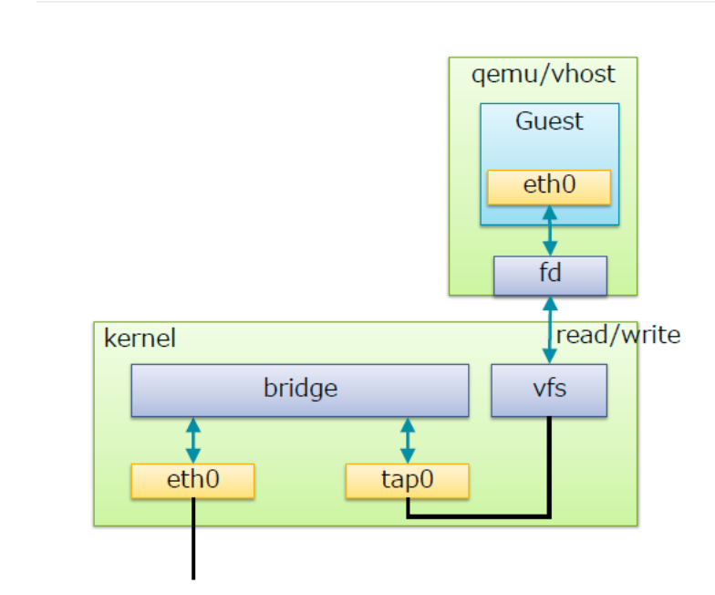

# Linux Bridge
## Linux Bridge là gì?
* Là một công nghệ switch ảo để giải quyết vấn đề ảo hóa Network bên trong các máy vật lý.


Được hiểu là 1 switch ảo được tạo ra nằm bên trong máy vật lý. Các VM kết nối đến đây để có thể liên lạc được với nhau. Nếu muốn liên lạc ra bên ngoài ta có thể kết nối switch này với card mạng trên máy vật lý của ta(giống như ta dùng dây kết nối từ switch với route). Ta có thể kết nối switch với 1 hoặc nhiều port.

* Set of network ports (or interfaces): Sử dụng để chuyển tiếp lưu lượng giữa switch và host.
* A control plane: Tính toán ngăn chặn các vòng lặp bị sập mạng.
* A forwarding plane: được xử dụng để xử lý các *unput frames* từ ports, chuyển tiếp chúng đến network port bằng các quyết định **MAC learning database**.
* **MAC learning database**: sử dụng để theo dõi các vị trí máy chủ trong mạng LAN.

## Cấu trúc của Linux Bridge


Trong đó:
* `Bridge`: switch ảo
* `tap` (tap interface): là giao diện mạng để các VM kết nối với switch do Linux Bridge tạo ra.
* fd (forward data): có nhiệm vụ chuyển dữ liệu từ VM đến switch. switch ảo do linux Bridge tạo ra có chức năng tương tự như 1 switch vật lý.


Cách kết nối của VM đi ra môi trường Internet. Khi máy vật lý của ta có card mạng kết nối vơi Internet(không phải wireless). Trên switch ảo của ta sẽ có đường để kết nối ra ngoài internet(cụ thể là kết nối với card mạng của máy vật lý). Ta có thể hình dung card mạng trên máy vật lý sẽ được gắn trực tiếp vào switch ảo nên ta có thể thấy sau khi add switch ảo và card vật lý có cùng địa chỉ MAC. Và trên card vật lý sẽ không còn địa chỉ IP mà nó được gắn cho switch ảo.


Khi các VM muốn giao tiếp với nhau hoặc ra ngoài Internet, ta chỉ cần kết nối VM với switch ảo. Lúc này card mạng trên VM sẽ được gắn với 1 cổng của switch ảo thông qua tap interface và cổng này có tên là `vnet`

Khi ta kết nối vào switch ảo các VM sẽ nhận địa chỉ IP cùng với dải địa chỉ IP của Card mà ta add và switch và các địa chỉ IP này sẽ được cung cấp bởi dịch vụ DHCP trên router.


## Chức năng của một Switch ảo do Linux Bridge tạo ra
* **STP**: là tính năng chống loop gói tin trong switch 
* **VLan**: là tính năng rất quan trọng trong một switch
* **FDB**: là tính năng chuyển gói tin theo database được xây dựng giúp tăng tốc độ của Switch

## Tạo và quản lý Brigde 
Tạ tạo bridge và tiến hành set IP, rời gắn card mạng vào nó.


```
nmcli connection add type bridge autoconnect yes con-name VLan22 ifname VLan22
nmcli connection modify VLan22 ipv4.addresses 2.2.2.3/24 ipv4.method manual
nmcli connection modify VLan22 ipv4.gateway 2.2.2.2
nmcli connection modify VLan22 ipv4.dns 8.8.8.8
nmcli conn delele ens38
nmcli connection add type bridge-slave autoconnect yes con-name ens38 ifname ens38 master VLan22
sytemctl restart network
```

Kiểm tra lại Switch ảo trên máy KVM và các Card add vào nó, nó sử dụng lệnh

`brctl show`


Bây giờ trên VM ta có thể kết nối đến switch ảo