# Tạo và quản lý máy ảo bằng command virsh 

## Tạo VM với Virsh 

Để tạo máy ảo bằng dòng lệnh, ta sử dụng lệnh `virt-install`.

Hầu hết các option đều không bắt buộc. Yêu cầu tối thiểu là: `--name`, `--memory`, `--disk`, `--filesystem`.

`virt-install --name=VM1 --vcpus=1 --memory=1024 --cdrom=/var/lib/libvirt/file-iso/CentOS-7-x86_64-Minimal-1804.iso --disk=/var/lib/libvirt/images/vm1.img,size=10 --os-variant=rhel7 --graphics vnc --network bridge=br0`

Trong đó: 
* `Virt-install`: Câu lệnh tạo máy ảo
* `--name`: Đặt tên cho máy ảo
* `--vcpus`: virtual cpu- Tổng số cpu ảo định đặt cho máy
* `--memory`: dung lượng RAM của máy ảo
* `--cdrom`: Đường dẫn tuyệt đối của file ISO. Nếu muốn boot bằng cách khác ta dùng option `--location` sau đó chỉ ra đường dẫn file(có thể là đường dẫn trên Internet) 
* `--disk`: chỉ ra vị trí lưu disk của máy ảo. size chỉ ra dung lượng muốn cấp cho ổ đĩa ảo. Có thể tạo thêm disk bằng cách thêm 1 dòng nữa.
* `--os-variant`: Chỉ ra kiểu hệ điều hành của máy ảo đang tạo. Option này có thể chỉ tạo ra hoặc không nhưng nên sử dụng nó vì nó sẽ cải thiện hiệu năng của máy ảo. Nếu bạn không biết HĐH của mminhf thuộc loại nào bạn có thể tìm kiếm thông tin bằng cách dùng lệnh `osinfo-query os`
* `--graphics`: Chọn kiểu màn hình tương tác
* `--network`: chỉ ra cách kết nối mạng của máy ảo. Nếu tạo nhiều card, ta chỉ cần khai báo thêm.

## Các trường hợp tạo máy ảo dùng virt-install 
### 1. Tạo máy ảo bằng file ISO
* Sử dụng option --cdrom
* Disk phải là không gian trống

`virt-install --connect qemu:///system --name iso --memory 1024 --vcpus 1 --disk /var/lib/libvirt/images/iso.image,size=10 --cdrom=/var/lib/libvirt/file-iso/CentOS-7-x86_64-Minimal-1804.iso --network network=default --graphics vnc,listen='0.0.0.0'`

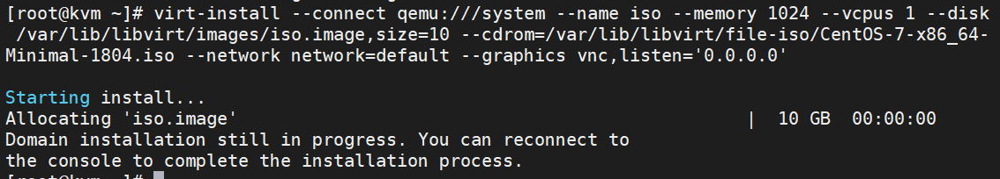

Khi thực hiện câu lệnh tạo vm xong truy cập bằng console của virt-manage để tiếp tục cài đặt

## Hiển thị danh sách máy ảo
`virsh list --all`

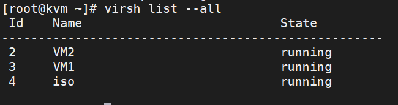

## Tắt VM
`virsh shutdown [Tên máy ảo]`

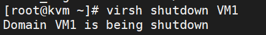

## Bật VM
`virsh start [tên VM]`

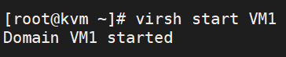

## Reboot VM
`virsh reboot [tên VM]`

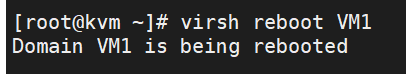

## Xóa máy ảo VM
`virsh underfine [tên vm]`

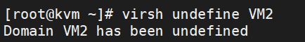

## Tạo Snapshot
`virsh snapshot-create-as --domain VM1 --name Begin --description "mo ta"`

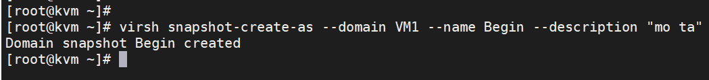

Lưu ý: snapshot chỉ được tạo khi định dạng disk ảo của ta sử dụng là **qcow2** chính vì vậy nếu bạn đang sử dụng định dạng **raw** mà muốn tạo snapshot thì cần phải chuyển xang định dạng **qcow2**
## Xem danh sách các bản snapshot trên 1 VM
`virsh snapshot-list [name_vm]`

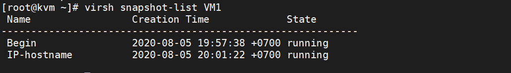

## Xem thông tin chi tiết của bản Snapshot
`virsh snapshot-info --domain [tên máy ảo] --snapshotname [tên bản snapshot]`

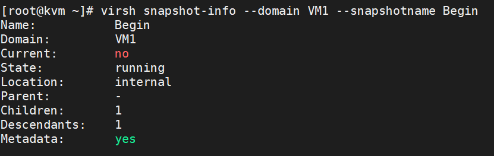

## revert để chạy lại một bản snapshot đã tạo
`virsh snapshot-revert [Name_VM] [Name_Snapshot]`

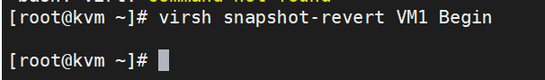

## Xóa 1 bản snapshot
`virsh snapshot-delete --domain [name_vm] --snapshotname [name_snapshot]`

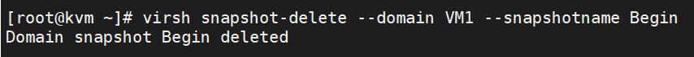

## Sửa thông tin CPU hoặc Memory
`virsh edit [name VM]`

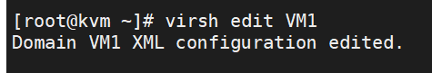
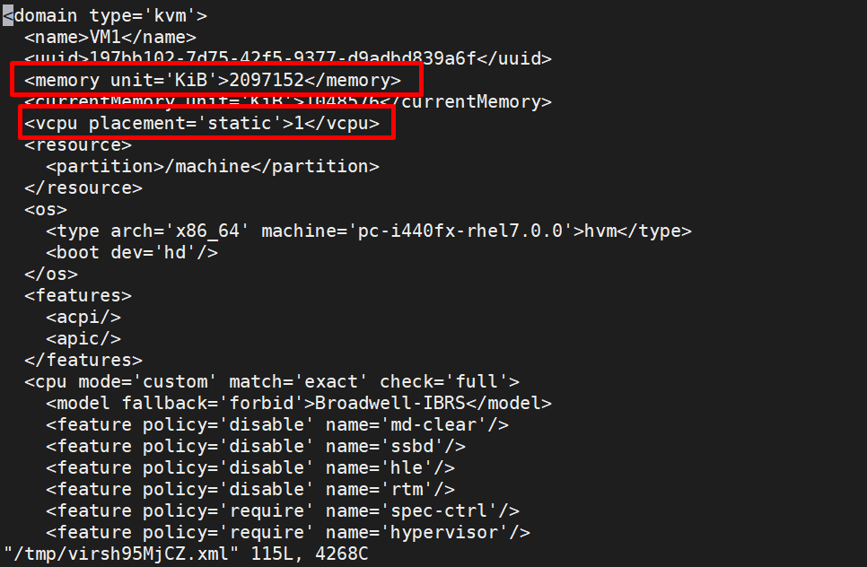
## Một số lệnh khác
### Xem thông tin chi tiết về file disk của VM
`qemu-img info [đường_dẫn_file-disk]`

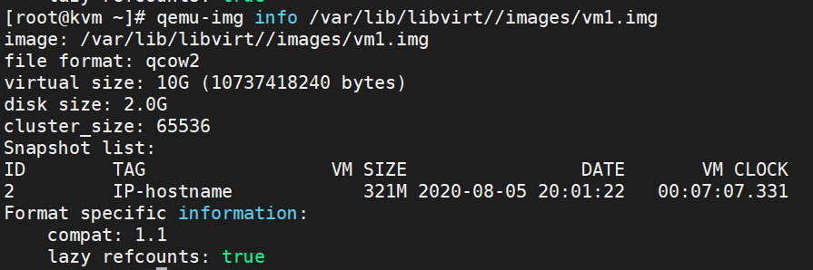

```
image: /var/lib/libvirt//images/vm1.img
file format: qcow2
virtual size: 10G (10737418240 bytes)
disk size: 2.0G
cluster_size: 65536
Snapshot list:
ID        TAG                 VM SIZE                DATE       VM CLOCK
2         IP-hostname            321M 2020-08-05 20:01:22   00:07:07.331
Format specific information:
    compat: 1.1
    lazy refcounts: true
```
### Xem thông tin cơ bản của 1 VM
`virsh dominfo [name vm]`

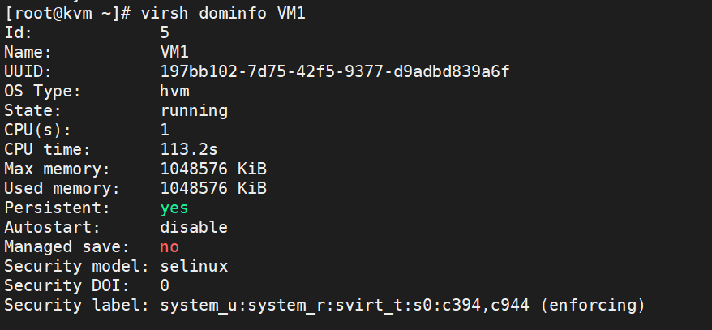

Link tham khao:

https://github.com/meditechopen/meditech-thuctap/blob/6c279735a8904e33bc37fca61ee2018913fdd83c/ThaoNV/KVM/virt-install.md

https://github.com/danghai1996/thuctapsinh/blob/master/HaiDD/KVM/kvm/06-virsh_commandOnkvm.md`