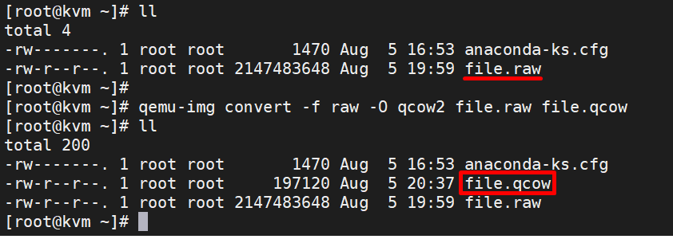

# File Image trong KVM

## 1. Tổng quan về file image trong KVM
* File Image của đĩa CD/DVD chính là một dạng File có định dạng theo các chuẩn tạo file image. File Image là một file đóng gói hết tất cả nội dung của một đĩa CD/DVD vào trong nó.
* Trong KVM Guest có 2 thành phần chính đó là **VM definition** được lưu trữ dưới dạng file xml tại `/etc/libvirt/qemu`. File này chứa các thông tin của máy ảo như tên, số RAM, số CPU... File còn lại là storage thường được lưu dưới dạng file image tại thư mục `/var/lib/libvirt/images`.
* 3 Định dạng thông dụng nhất của file image sử dụng trong KVM đó là ISO, raw và qcow2.

## 2. Định dạng file image phổ biến trong KVM
## File ISO
* File ISO là một file image của một đĩa CD/DVD, nó chứa chứa toàn bộ dữ liệu của đĩa CD/DVD đó. File ISO thường được sử dụng để cài đặt hệ điều hành của VM, người dùng có thể Import trực tiếp hoặc tải từ Internet về.
* Boot từ file ISO cũng là một trong số những tùy chọn mà người dùng có thể sử dụng khi tạo máy ảo.

## File raw
* Là định dạng file Image phi cấu trúc
* Khi người dùng tạo mới một máy ảo có disk format là raw thì dung lượng của file disk sẽ đúng bằng dung lượng của ổ đĩa máy ảo bạn đã tạo
* Định dạng raw là image theo dạng nhị phân(bit by bit) của ổ đĩa.
* Mặc định khi tạo máy ảo với virt-manager hoặc không khai báo khi tạo VM bằng virt-install thì định dạng ổ đĩa sẽ là raw. Hay nói cách khác, raw chính là mặc định của QEMU
## QCOW2 
* qcow (QEMU Copy On Write) là một định dạng tập tin cho image các tập tin được sử dụng bởi QEMU, một tổ chức màn hình áo ảo
* Nó sử dụng một chiến lược tối ưu hóa lưu trữ đĩa để trì hoãn phân bổ dung lượng lưu trữ cho đến khi nó thực sự cần thiết (cho cơ chế thin).
* qcow2 là một phiên bản cập nhật của định dạng qcow, nhằm để thay thế nó. Khác biệt với bản góc là qcow2 hỗ trợ nhiều Snapshots thông qua một mô hình mới, Linh hoạt để lưu trữ hình ảnh chụp nhanh. Khi khởi tạo máy ảo mới sẽ dựa vào disk này rồi snapsot thành một máy mới.
* Hỗ trợ Copy-onWrite với những tính năng đặc biệt như snapshot, mã hóa, nén dữ liệu...
* Hỗ trợ việc tăng bộ nhớ bằng cơ chế Thin Provioning(máy ảo dùng bao nhiêu file có dung lượng bấy nhiêu)
## So sánh RAW với QCOW2
### 1. Dung lượng
Để kiểm tra dung lượng của 2 định dạng này, ta sẽ dùng lệnh `qemu-img` để tạo ra một file có định dạng raw và một file có định dạng qcow2 cả 2 file này đều có dung lượng là 2G

File `raw`:

`qemu-img create -f raw file.raw 2G`

File `qcow2`:

`qemu-img create -f qcow2 file.qcow2 2G`


Ta nhận thấy, thì tạo 2 file đều có dung lượng là 2G, Nhưng sau khi kiểm tra thực tế thì ta thấy có định dạng qcow2 chỉ có dung lượng là 193K còn định dạng raw thì vẫn là 2G


### 2. Performance (hiệu năng)
Để test hiệu năng của 2 định dạng này ta sử dụng câu lệnh `dd` để đọc và ghi dữ liệu từ các file trên.

**Đọc dữ liệu**: raw < qcow2
```
dd if=file.raw of=test1 bs=8k count=100000
dd if=file.qcow2 of=test2 bs=8k count=100000
```


Ghi dữ liệu: raw > qcow2

```
dd if=/dev/zero of=file.raw bs=8k count=100000
dd if=/dev/zero of=file.qcow2 bs=8k count=100000
```

### 3. Tạo snapshot
Chỉ có `qcow2` hỗ trợ tạo snapshot

### 4. chuyển đổi giữa `raw` và `qcow2`
Chuyển từ `qcow2` sang `raw` :

`qemu-img convert -f qcow2 -O raw file.qcow2 file.raw`


Chuyển từ `raw` sang `qcow2` :

`qemu-img convert -f raw -O qcow2 file.raw file.qcow2`



**Chú ý**: chuyển đổi này chỉ thực hiện được khi VM đang được tắt và khi chuyển đổi xong phải tiến hành sửa lại file xml tương ứng