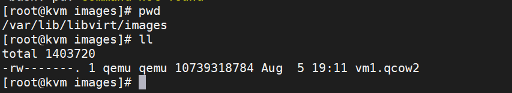
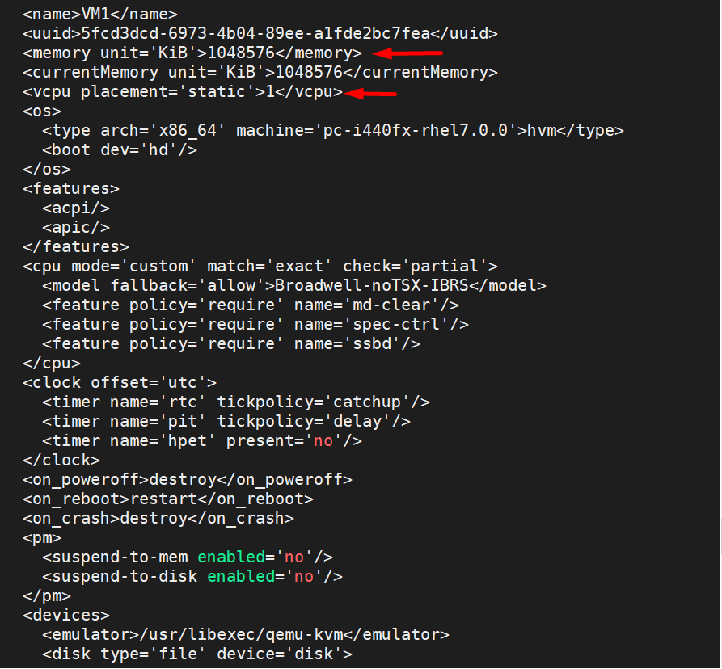
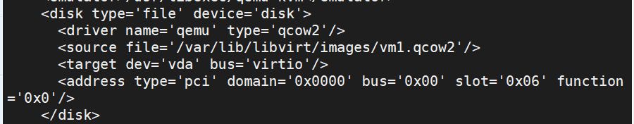
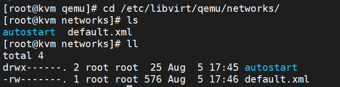
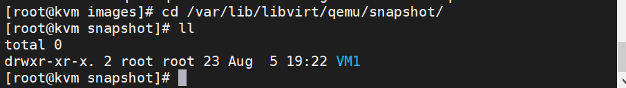

# Các file của VM trên KVM
Sau đây là tìm hiểu của mình về các cấu trúc file cấu hình mặc định của VM trên KVM

Ở đây mình sẽ giới thiệu 2 nhánh chính của thư mục:
* **/var/lib/libvirt**
* **/etc.libvirt/qume**
## Thư mục chứa các disk của VM
`/var/lib/libvirt/images/`

107

## Thư mục chứa file `.xml` thông số kỹ thuật của VM

`/etc/libvirt/qemu/`

tại file xml của VM có thể thay đổi một số thông số phần cứng như:

Virtual RAM, vcpus:

Thay đổi đường dẫn cho file Image:

## Thư mục chứa các file liên quan đến network

`/etc/libvirt/qemu/networks/`

## Thư mục chứa các file Image
`/var/lib/libvirt/images/`

## Thư mục chứa các bản snapshot
`/var/lib/libvirt/qemu/snapshot/`

