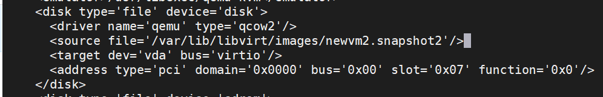

Hướng dẫn tạo Snapshot trên VM
1. [Giới thiệu snapshot](#1)
2. [Hướng dẫn tạo và quản lý Internal Snapshot](#2)
3. [Hướng dẫn tạo và quản lý External Snapshot](#3)
4. [Revert lại trạng thái của snapshot](#4)
5. [Xóa Snapshot](#5)

<a name="1">
<a name="2">
<a name="3">
<a name="4">
<a name="5">

## Giới thiệu

* Snapshot là trạng thái của hệ thống tại một thời điểm nhất định, nó sẽ lưu lại cả những cài đặt và dữ liệu. Với snapshot, Bạn có thể quay trở lại trạng thái của máy ảo ở một thời điểm nào đó dễ dàng.
* Libvirt hỗ trợ việc tạo snapshot khi máy ảo đang chạy. Mặc dù vậy, Nếu máy ảo của bạn đang chạy ứng dụng thì tốt hơn hết hãy tắt hoặc suspend trước khi tiến hành tạo snapshot. 
* Có 2 loại snapshot chính được hỗ trợ bởi Libvirt:
    * Internal: Trước và sau khi tạo snapshot, dữ liệu chỉ được lưu trên một ổ đĩa duy nhất. Người dùng có thể tạo Internal Snapshot bằng công cụ virt-manager. Mặc dù vậy nó vẫn có một vài hạn chế:
        * Chỉ hỗ trợ duy nhất định dạng Qcow2
        * VM sẽ bị ngưng lại khi Snapshot 
        * Không không hoạt động với LVM storage pôls
    * External: dựa theo cơ chế *copy-on-write*. Khi Snapshot được tạo, ổ đĩa ban đầu sẽ có trạng thái read-only và có một ổ đĩa khác đè dữ liệu lên để lưu dữ liệu mới.
        *  Ổ đĩa được đè lên được tạo ra có định dang Qcow2, hoàn toàn trống và nó có thể chứa lượng dữ liệu giống như ổ đĩa ban đầu. External snapshot có thể được tạo với bất kỳ định dạng ổ đĩa nào mà Libvirt hỗ trợ. Tuy nhiên không có công cụ đồ họa hỗ trợ cho việc này.
<a name="2">

## Tạo và quản lý Internal Snapshot
* Internal Snapshot chỉ hỗ trợ định dạng qcow2 vì thế hãy rằng ổ đĩa của máy ảo thuộc định dạng nào bằng câu lệnh `qemu-img info [đường dẫn disk]`. Nếu định dạng ổ đĩa không phải định dạng qcow2, hãy chuyển nó sang định dạng này bằng câu lệnh `qemu-img convert`
* Một với câu lệnh `virsh` liên quan tới việc tạo và quản lý máy ảo:
    * `snapshot-create`: Tạo snapshot từ file XML
    * `snapshot-create-as`: Tạo snapshot với các tùy chọn
    * `snapshot-current`: Thiết lập hoặc lấy thông tin của snapshot hiện tại
    * `snapshot-delete`: Xóa một snapshot
    * `snapshot-dumpxml`: Tạo thêm một file XMl cho snapshot
    * `snapshot-edit`: Chỉnh sửa file XML của snapshot
    * `snapshot-info`: Lấy thông tin của snapshot 
    * `snapshot-list`: Lấy danh sách các snapshot
    * `snapshot-parent`: lấy tên của snapshot "cha" của một snapshot nào đó
    * `snapshot-revert`: Quay trở về trạng thái khi tạo snapshot

* Để tạo mới một Internal Snapshot, thông thường ta sử dụng câu lệnh:

`virsh snapshot-create-as [Tên vm] --name "[tên snapshot]" --description "[miêu tả]" --atomic`

ví dụ: Tạo Snapshot cho VM có tên là: **newvm**  lấy tên snapshot là **ss-begin**.

`virsh snapshot-create-as newvm --name "ss-begin" --description "ss begin" --atomic`

* Người dùng có thể tạo ra nhiều các snapshot, thêm tùy chọn --parent vào snapshot-list để hiển thị ra danh sách snapshots theo mối quan hệ "cha-con"

vd:

* Để quay trở lại trạng thái của một Internal Snapshot, dùng câu lệnhL

`virsh snapshot-revert [Tên vm] --snapshotname "[tên Snapshot]"`

ví dụ:

`virsh snapshot-revert newvm --snapshotname "ss-begin"`

* Để xóa một Internal Snapshot sử dụng lệnh: 

`virsh snapshot-delete [Tên vm] [tên Snapshot]`

<a name="3">

## Tạo và quản lý External Snapshot
### Tạo Snapshot
* Tiến hành kiểm tra ổ đĩa mà máy ảo muốn tạo Snapshot đang sử dụng bằng câu lệnh:

`virsh domblklist [Tên Vm] --details`

* Tiến hành tạo Snapshot bằng câu lệnh, tắt VM trước khi thực hiện câu lệnh: 

`virsh snapshot-create-as [tên VM] snapshot1 "[Tên Snapshot 1]" --disk-only --atomic`

Trong đó `--disk-only`: Dùng để tạo snapshot cho riêng ổ đĩa

ví dụ:

* Check lại danh sách bằng câu lệnh:

`virsh snapshot-list [tên VM]`

* Snapshot đã được tạo tuy nó chỉ lưu trữ duy nhất trọng thái ổ đĩa:

* Kiểm tra lại ổ đĩa mà máy ảo đang sử dụng:

Lúc này ổ đĩa cũ đã trở thành trạng thái `read-only`, vm dùng ổ đĩa mới đẻ lưu dữ liệu và `backingfile` sẽ là ổ đĩa ban đầu. Hãy xem thông tin của ổ đĩa này:

<a name="4">

### Revert lại trạng thái snapshot của External Snapshot

* Bạn phải cấu hình file XML bằng câu lệnh bởi Libvirt chưa hỗ trợ cho việc này. 

Giả sử VM đang ở **snapshot2**  và bạn muốn quay trở lại **snapshot1**:
1. Lấy đường dẫn tới ổ đĩa được tạo ra khi Snapshot:

`virsh snapshot-dumpxml newvm3 --snapshotname snapshot1 | grep 'soucre file' | head -1`

`<source file='/var/lib/libvirt/images/newvm2.snapshot1'/>` là đường dẫn của snapshot1

2. Kiểm tra để nó còn nguyên vẹn và được kết nối đến backing file

`qemu-img check /var/lib/libvirt/images/newvm2.snapshot1`

`qemu-img info /var/lib/libvirt/images/newvm2.snapshot1`

3. Chỉnh sửa file XML, bỏ ổ đĩa hiện tại và thay thế bằng ổ đĩa ở trạng thái snapshot1

`virsh edit [tên VM]`

Sửa thành:

define lại file xml
`virsh define [Đường dẫn file XML của máy ảo]`

Reboot lại máy ảo

4. Kiểm tra lại file máy ảo đã sử dụng đúng ổ đĩa chưa:

`virsh domblklist [tên VM]`

<a name="5">

## Xóa External Snapshot
* Quy trình xóa một External snapshot khá phức tạp. Để có thể xoám trước tiên bạn phải tiến hành hợp nhất nó với ổ đĩa cũ. Có hai kiểu hợp nhất đó là:
    * Blockcommit: Hợp nhất dữ liệu với ổ đĩa cũ
    * Blockpull: Hợp nhất dữ liệu với ổ đĩa được tạo ra khi snapshot. Ổ đĩa sau khi hợp nhất sẽ luôn có định dạng qcow2.
### Hợp nhất sử dụng Blockcommit
* Kiểm tra ổ đĩa hiện tại mà máy ảo đang sử dụng

`virsh domblklist [tên VM]`

* Xem thông tin backingfile của ổ đĩa đang được sử dụng:

`qemu-img info --backing-chain [Đường dẫn file] | grep backing`

ví dụ

`qemu-img info --backing-chain /var/lib/libvirt/images/newvm2.snapshot3 | grep backing`

* Hợp nhất snapshot:

`virsh blockcommit [tên vm] hda --verbose --pivot --active`

`virsh blockcommit newvm2 /var/lib/libvirt/images/newvm2.snapshot1 --verbose --pivot --active`
