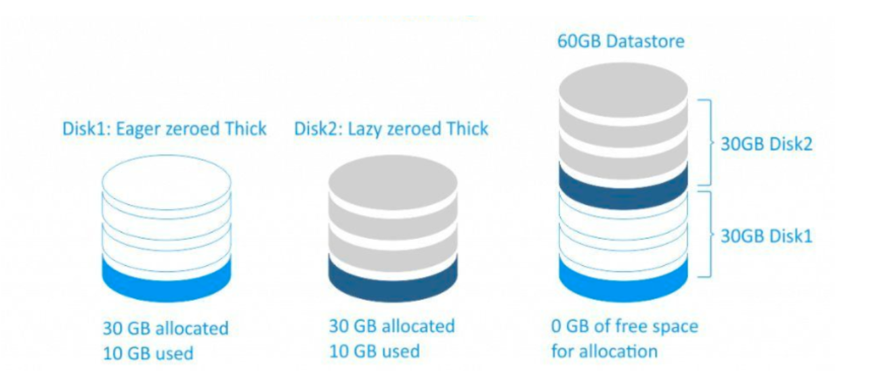
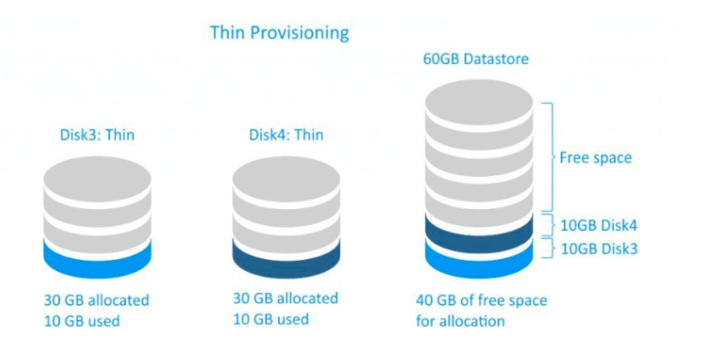

# Cơ chế lưu trữ Thin-Thick
## 1.Thick
Với cơ chế loại này khi ta tạo một disk ảo cho VM nó sẽ nhận nguyên dung lượng dick đó làm disk của nó dù cho nó chưa sử dụng hết dung lượng disk đó.

Thick có 2 loại:

1. **Thick lazy**: Khi tạo một disk cho VM nó sẽ ánh xạ đến một vùng trên disk thật. Nó nhận đủ dung lượng disk mà ta tạo cho VM và nó sẽ không xóa dữ liệu cũ trên disk(nếu có) khi ghi cái gì lên đó thì nó mới xóa dữ liệu dó đi. Chính vì vậy nên việc tạo đĩa ảo sẽ rất nhanh nhưng sẽ mất nhiều thời gian cho lần ghi đầu tiên do phải xóa dữ liệu cũ nếu có.

2. **Thick Eager**: Cũng giống như thick lazy nó cũng nhận toàn bộ dung lượng mà ta tạo disk cho VM. Nó sẽ ghi toàn bộ bit 0 lên phần dung lượng chưa được sử dụng của disk ảo(giống như ta tạo file với câu lệnh dd). vì vậy khi ta tạo dík cho VM ở kiểu này sẽ lâu hơn so với thick lazy nhưng với lần ghi đầu tiên sẽ nhanh hơn.

Như ta thấy thì nó sẽ rất lãng phí dík. Nếu ta có 1 disk với dung lượng 60G, ta tạo ra 2 máy ảo với cơ chế thick mỗi máy 30G. Ta sẽ không thể tạo thêm máy ảo mặc dù 2 máy ảo đã tạo không sử dụng hết 60GB disk

## Thin

Với cơ chế thin sẽ tránh được sự lãng phí dung lượng ổ cứng so với thick. Cơ chế này thì VM chỉ chiếm dung lượng bằng đúng phần dung lượng mà nó đang lưu trữ. Vì vậy với phần dung lượng còn trống ta vẫn có thể làm việc khác.

Với cơ chế này ta có thể tận dụng được hết dung lượng disk.

Tuy nhiên, nếu dung lượng đĩa cứng bị hết thì tất cả các VM trên đó sẽ gặp vấn đề vì không còn dung lượng để sử dụng.