# Sử dụng Tcpdump trên hệ điều hành Linux để bắt gói tin mạng
## Giới thiệu về tcpdump

tcpdump là phần mềm bắt gói tin trong mạng làm việc trên hầu hết các phiên bản hệ điều hành Linux.
* Cho phép chúng ta bắt và lưu lại các gói tin bắt được, để chúng ta có thể sử dụng phân tích.

Các tùy chọn thường sử dụng trong Tcpdump:

* `-D` liệt kê các thiết bị mạng trong máy:

`tcpdump -D`

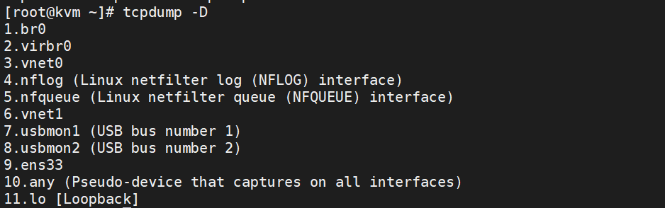

* 

## Sử dụng câu lệnh tcpdump để bắt các gói tim ICMP.

Mô hình:

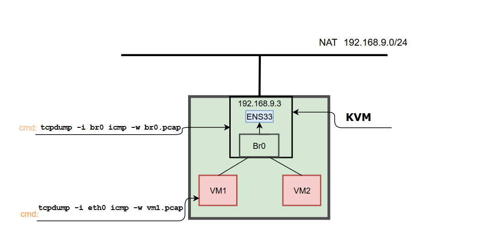

* KVM được sử dụng Mô hình NAT để có thể truy cập ra môi trường Internet
* Vm được sử dụng chế độ Bridge với brO của KVM

Bắt các gói tin lưu vào file:

câu lệnh:

* `tcpdump -i br0 icmp -w br0.pcap`: Được thực hiện trên KVM- 
* `tcpdump -i eth0 icmp -w VM1.pcap`: Được thực hiện trên máy vm1
    * Giải thích: 
        * `tcpdump`: sử dụng lệnh tcpdump
        * `-i br0`: bắt các gói tin ở network interface **eth0**
        * `icmp` : bắt các gói tin icmp
        * `-w br0.pcap`: lưu vào file có tên **br0.pcap** phân tích ở phần sau

### Thực hiện bắt gói tin icmp
Kiểm tra các Interface:

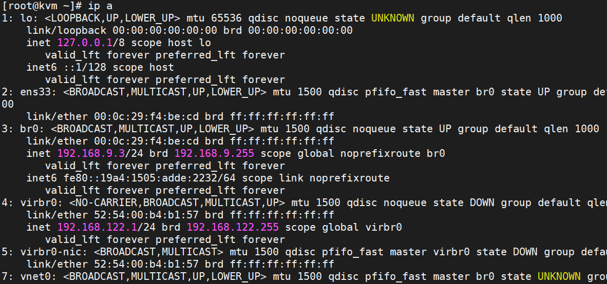


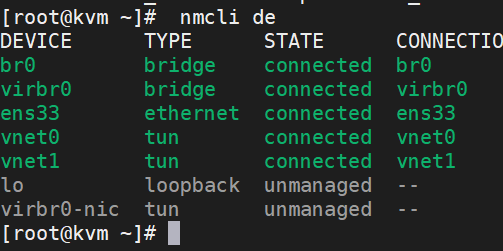


Ta thực hiện bắt gói tin ICMP trên các điểm `eth0` của **VM**, `vnet0`(tap), `br0`, `ens33` của **KVM**

* **KVM**:
```
tcpdump -i ens33 icmp -w ens33.pcap
tcpdump -i br0 icmp -w br0.pcap
tcpdump -i vnet0 icmp -w vnet0.pcap
```

Thực hiện trên 3 tab:

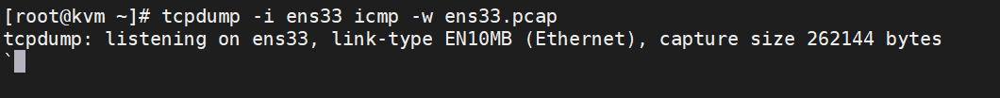

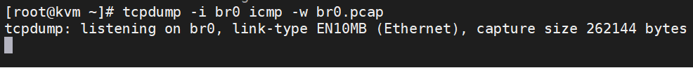

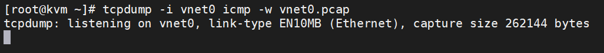

* **VM**:

`tcpdump -i eth0 icmp -w vm1.pcap`

* Đứng tại VM1 Ping `news.cloud365.vn`: 

`ping news.cloud365.vn -c 1`

### Phân tích kết quả của bản tin.

Mô hình bắt gói tin:

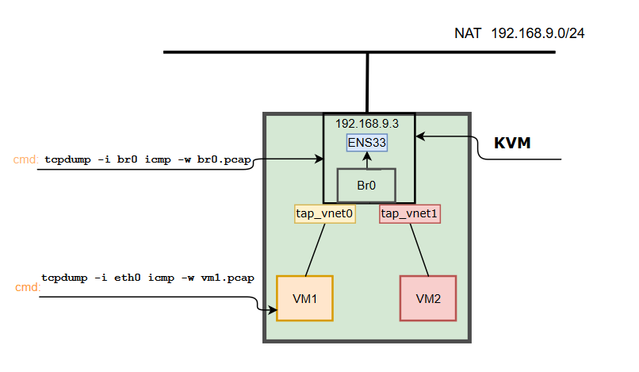

`tap_vnet0` (tap interface): là giao diện mạng để các VM kết nối với switch do Linux Bridge tạo ra.

* VM

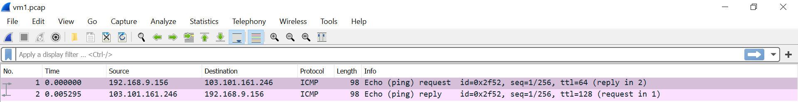
* KVM

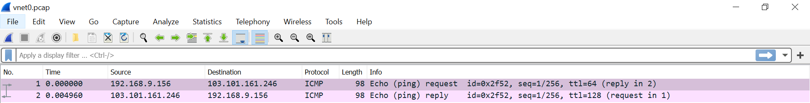

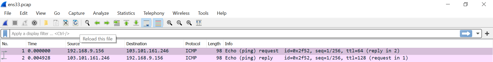


