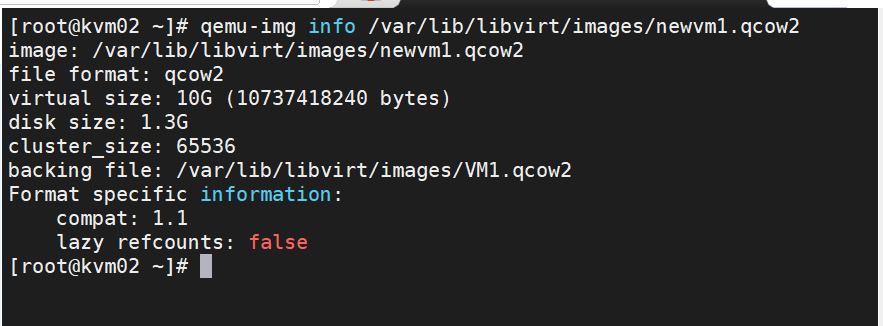

# Tìm hiểu về Template 
1. [Giới thiệu về Template trong KVM](#1)
2. [Hướng dẫn tao Template từ VM](#2)
3. [Hướng dẫn tạo và quản lý Template](#3)

<a name="1">
## Hướng dẫn tạo Template từ VM

### 1. Giới thiệu về Template trong KVM
* Template là một dạng file image pre-configured của hệ điều hành dùng để tạo nhanh các máy ảo. Sử dụng Template sẽ tránh những bước cài đặt lặp đi lặp lại và tiết kiệm nhiều thời gian hơn so với từng bước một.
* Việc sử dụng Template, số bước mà người dùng phải thực hiện sẽ được rút ngắn đi rất nhiều, chỉ cần thực hiện 1 lần các bước trùng lặp rồi tạo Template là bạn có thể rút ngắn được thời gian

### 2. Hướng dẫn tạo và quản lý Template
* Hai khái niệm cần phân biệt là `clone` và `Template`.
  * `Clone`: Tạo ra một bản sao của máy ảo
  * `Template`: nó có thể được dùng để tạo ra nhiều clone của máy khác nữa.
* Có hai phương thức để triển khai máy ảo từ Template là Thin và Clone:
  * Thin: Máy ảo được tạo ra theo phương thức này sẽ sử dụng như một base image, lúc này nó sẽ chuyển sang trạng thái read-only. Cùng với đó, sẽ ó một ổ mới hỗ trợ "copy on read" được thêm vào để lưu trữ mới. Phương thức này sẽ tốn phương thức này sẽ tốn ít dung lượng hơn tuy nhiên các VM tạo ra sẽ phụ thuộc vào base image, chúng sẽ không chạy được nếu không có base image.
  * Clone: Máy ảo được tạo ra làn một bản sao hoàn chỉnh và hoàn toàn không phụ thộc vào template cũng như máy ảo ban đầu. Mặc dù vậy, nó sẽ chiếm dung lượng giống như máy ảo ban đầu.
<a name="2">

## Tạo Template
* Template thực chất là máy ảo được chuyển đổi sang. Quá trình này gồm 3 bước:
  * Bước 1: Cài đặt máy ảo với đầy đủ các phần mềm cần thiết để biến nó thành một Template, ví dụ(LAMP, LEMP, WordPress hoặc WordOps)
  * Bước 2: Loại bỏ tất cả các cài đặt cụ thể ví dụ như Password SSH, địa chỉ MAC.. để đảm bảo rằng nó sẽ không được áp dụng giống với nhau tới tất cả các máy ảo đươc tạo ra sau này.
  * Bước 3: Đánh dấu máy ảo là Template bằng việc đổi tên.
<a name="3">

### Các bước tạo Templates

* KVM đã được cài thành công và VM đã được cài đủ option để chọn Template.
* Shutdown máy ảo

`virsh shutdown [Tên máy ảo]`
* Sử dụng lệnh `virt-sysprep` để niêm phong máy ảo:
  * `virt-sysprep` là tiện ích nằm trong gói **libguestfs-tools-c**(Một bộ công cụ để truy cập và sửa đổi image của máy ảo) được sử dụng để loại bỏ những thông tin cụ thể của hệ thống đồng thời niêm phong biến máy ảo thành Templates 
  * Có 2 option để dùng `virt-sysprep`, 
    * `-a`: Được sử dụng với đường dẫn máy ảo
    * `-d`: được sự dụng với tên hoặc UUID của máy ảo.

* Đánh dấu máy ảo trở thành Templates. Người dùng cũng có thể backup file XML bằng câu lệnh

`virsh dumpxml Template_VMname > /root/Template_VMname.xml`

* Để undefine máy ảo, chạy câu lệnh `virsh undefine VMname`

### Tạo Templates
* Shutdown máy ảo

`virsh shutdown [Tên máy ảo]`

* Cài đặt gói `libguestfs-tools-c`

`yum -y install libguestfs-tools-c`
* Sử dụng `virt-sysprep` để loại bỏ các thông tin cấu hình như UUID, MAC,... đồng thời niêm phong và biến máy ảo thành Templates.

`virt-sysprep -d [Tên VM]`

* Backup file XML của Templates bằng cách `dumpxml`

`virsh dumpxml [Tên máy ảo] > /root/[tên Template].xml`

ví dụ tôi backup file template dành cho **wordpress** với tên máy ảo là `VMvanphong`

`virsh dumpxml VMvanphong > /root/template-Setup_WP.xml`

* Undefine máy ảo

`virsh undefine [tên máy ảo]`

* Tạo ra file image mới với định dạng qcow2 để làm file backup bằng câu lệnh: 

`qemu-img create -b /var/lib/libvirt/images/VMvanphong.qcow2 -f qcow2 /var/lib/libvirt/images/newvm.qcow2`

* Kiểm tra xem file mới tạo đã được chỉ tới file backup của nó hay chưa bằng câu lệnh:

`qemu-img info [địa chỉ file disk mới]`

ví dụ:

`qemu-img info /var/lib/libvirt/images/newvm.qcow2`

* Sử dụng `virt-clone` để tạo máy ảo từ file XML và image đã được backup:

`virt-clone --original-xml [file được lấy backup] -f [file disk mới] -n [Tên VM mới] --preserve-data`

  * Nếu muốn VM có disk tách hẳn ra, ta thay `--preserve-data` thành `--auto-clone`

Ví dụ:

`virt-clone --original-xml  /root/template-Setup_WP.xml -f /var/lib/libvirt/images/newvm.qcow2 -n newvm --preserve-data`

hoặc:

`virt-clone --original-xml  /root/template-Setup_WP.xml -f /var/lib/libvirt/images/newvm2.qcow2 -n newvm2 --auto-clone`

>**Chú ý**: nếu sử dụng option `--preserve-data` sẽ tiết kiệm bộ nhớ, nhưng khi file template bị xóa thì các máy ảo sử dụng option này cũng không thể chạy được.
