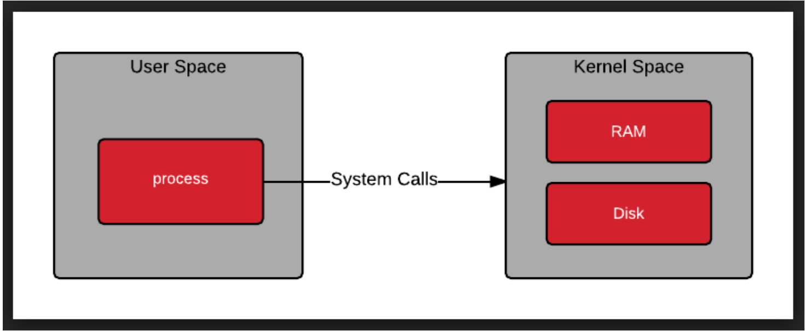
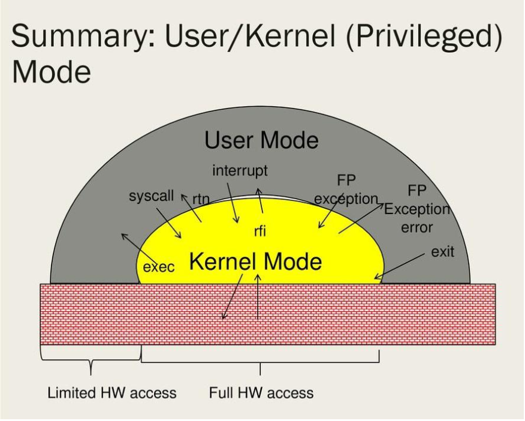

# CPU X86
**Thuật ngữ X86** dùng để chỉ đến kiến trúc của tập lệnh của dòng vi xử lý 8086 của Intel. 8086 được Intel đưa ra năm 1978.

Kiến trúc X86 phổ biến cho các thế hệ máy tính cá nhân đang hiện hữu trên thế giới. Kiến trúc X86 gần như chiếm toàn bộ thị phần máy tính cá nhan, máy tính workkstaiton và cả server thậm chí siêu máy tính. 

X86 được lấy 2 số cuối của các thế hệ chíp của intel như 8086, 80386, 80486. Khi nhắc đến X86 thường là nhắc đến bộ nhớ 32bit nhưng thế hệ này chỉ hỗ trợ tối đa 2^32bit tương đương với khoản 4GB RAM. Vì vậy thế hệ sau này X86-64 thanh ghi đã được mở rộng lên đến 64bit để đáp ứng nhu cầu của máy tính.

## Users Space

UsUser Space là không gian bộ nhớ dùng để chạy các ứng dụng người dùng. Nó không thể truy cập vào Kernel Space điều này để đảm bảo an toàn cho Kernel. Muốn truy cập vào System Kernel phải truy cập thông qua System Calls. System Calls hoạt động như một phần mềm bên trong Kernel Space.

Kernel Space là không gian bộ nhớ dùng để chạy các chương trình hệ thống. Nó có đặc quyền cao nhất mà người dùng không thể can thiệp vào. Nó quản lý các ứng dụng người dùng

## Phân biệt User Space và Kernel Space

Trong Linux kernel, biết được cách memory được chia tách như thế nào bên trong hệ thống cực kỳ quan trọng. Vì biết các chương trình nằm ở đâu và yêu cầu trên hệ thống để có thể di chuyển memory từ nơi này đến nơi khác, có thể cung cấp cho chúng ta một cái nhìn sâu sắc về performance, hoặc những thiếu xót bên trong hệ thống. Và nói đến networking - nơi chúng ta cần di chuyển các gói tin thông qua một hệ thống, việc có ý kiến thúc này thậm chí trở nên quan trọng hơn bao giờ hết.

Memory được chia vào 2 khu vực, còn được biết đến là kernel space và user space.

* Kernel Space: Mã thực thi có quyền truy cập không gian hạn chế vào bất kỳ không gian địa chỉ nào của Memory và tới bất kỳ phần cứng nào. Nó đươc dành riêng cho các chức năng có độ tin cậy cao nhất bên trong hệ thống. Kernel Mode thường được dành riêng cho các chức năng được hoạt động ở cấp độ thấp nhất. Đáng tin cậy nhất của hệ điều hành. Do số lượng truy cập mà kernel có, bất kỳ sự không ổn định nào bên trong mã thực thi kernel cũng có thể dẫn đến lỗi hệ thống hoàn toàn.

* User Space: Mã thực thi bị giới hạn truy cập. Nó là không gian địa chỉ mà các Peocess user thông thường chạy. Những Processes không thể truy cập trực tiếp tới kernel space được. Khi đó lời gọi API được sử dụng tới kernal để truy vấn memory và truy cập thiết bị phần cứng. Bởi truy cập bị hạn chế, Các trục trặc hay vấn đề gì xảy ra trong user mode chỉ bị giới hạn trong không gian hệ thống mà chúng đang hoạt động và luôn có thể khôi phục được. Hầu hết các đoạn mã đang chạy trên máy tính của bạn sẽ thực thi trong user mode.

https://blog.vu-review.com/kernel-space-va-user-space.html

https://vimentor.com/vi/lesson/gioi-thieu-ve-linux-kernel-1