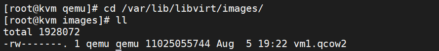
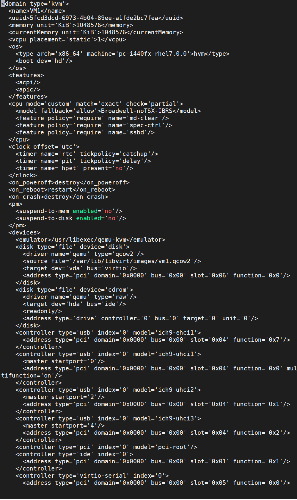
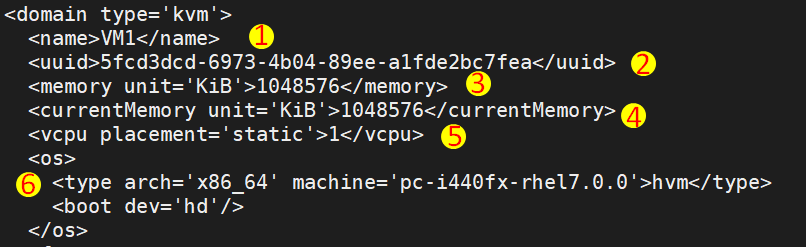
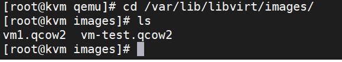
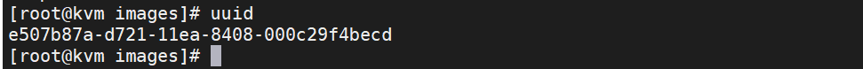
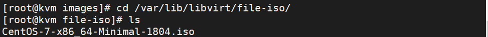

# Tìm hiểu file XML trong KVM và Tạo VM bằng file XML

## Khái niệm về XML

**XML(eXtensible Markup Language)** là một file có khả năng lưu trữ nhiều lại dữ liệu khác nhau. Mục đích của Xml Là đơn giản hóa việc chia se dữ liệu giữa các hệ thống khác nhau, đặc biệt là các hệ thống đượng kết nối với internet.

**XML trong KVM**
Một VM trong KVM có hai thành phần chính đó là:
* VM's Definition được lưu dưới dạng file XML và nằm trong thư mục `/etc/libvirt/qemu/`


* VM's Storage lưu dưới dạng file Image.

`/var/lib/libvirt/images/`



File domain XML chứa các thông tin về máy ảo như số cpu, RAM, các thiết lập I/O, card mạng,...

Ngoài file XML còn có các file XML khác để lưu thông tin network, Storage,...

## Các thành phần trong file domain XML của VM

Ta có thể dùng lệnh `virsh edit [Tên file]` để chỉnh sửa (chú ý file bỏ phần đuôi `.xml`) hoặc ta có thẻ dùng `vi` hoặc `vim` để chỉnh sửa nó.

`virsh edit VM1`



Có rất nhiều thành phần trong file xml này. Ở đây, ta sẽ tìm hiểu một số thành phần chính như sau:



* 1: Name- Tên của VM
* 2: UUID (Universally Unique Identifier)
* 3: Memory: Dung lượng Ram của VM ,`unit` đơn vị tính của RAM
* 4: currentMemory: dung lượng ram hiện tại
* 5: Số CPU ảo được sử dụng
* 6: os- Hệ điều hành đang được sử dụng trên máy ảo.

### Các thành phần có trong device
***Thông số của disk***

```

<disk type='file' device='disk'>
    <driver name='qemu' type='qcow2'/>
    <source file='/var/lib/libvirt/images/vm1.qcow2'/>
    <target dev='vda' bus='virtio'/>
    <address type='pci' domain='0x0000' bus='0x00' slot='0x06' function='0x0'/>
</disk>


<disk type='file' device='cdrom'>
    <driver name='qemu' type='raw'/>
    <target dev='hda' bus='ide'/>
    <readonly/>
    <address type='drive' controller='0' bus='0' target='0' unit='0'/>
</disk>
```
***Thông số của Interface***: Phần card mạng
```
<interface type='bridge'>
    <mac address='52:54:00:2a:3c:63'/>
    <source bridge='br0'/>
    <model type='virtio'/>
    <address type='pci' domain='0x0000' bus='0x00' slot='0x03' function='0x0'/>
</interface>
```
* `interface type` Kiểu card mạng đang sử dụng
* `mac` địa chỉ MAC của card mạng
* `source` tên card mạng được gán

## Tao VM bằng file domain XML
### Chuẩn bị file disk.
Sử dụng câu lệnh

`qemu-img create -f qcow2 /var/lib/libvirt/images/vm-test.qcow2 10G`



### Tạo uuid 



## Tạo CD-ROM

download hoặc chuẩn bị file ISO tại file: `/var/lib/libvirt/file-iso/`



### Tạo một file domain XML.
Ta sẽ tạo một máy ảo với thông số sau:

* 1024 RAM, CPU: 1
* Path disk: `/var/lib/libvirt/images/vm-test.qcow2` 
* Path CD-ROM: `/var/lib/libvirt/file-iso/CentOS-7-x86_64-Minimal-1804.iso`
* Sử dụng card mạng: `br0`
* `uuid`: e507b87a-d721-11ea-8408-000c29f4becd


Sao chép file xml từ một VM đã khởi tạo

```
cd /etc/libvirt/qemu
wget https://raw.githubusercontent.com/huydv398/Ghichep-KVM/master/bash/test-vm.xml

#Đổi các thông số bên dưới

sed -i 's/[name]/[Tên VM]/g' /etc/libvirt/qemu/test-vm.xml
sed -i 's/[uuid]/[điền UUID]/g' /etc/libvirt/qemu/test-vm.xml
sed -i 's/[ram]/[Điền thông số muốn đặt cho RAM]/g' /etc/libvirt/qemu/test-vm.xml
sed -i 's/[vcpu]/[Điền số CPU]/g' /etc/libvirt/qemu/test-vm.xml
sed -i 's/[type-disk]/[điền loại raw hoặc qcow2]/g' /etc/libvirt/qemu/test-vm.xml
sed -i 's/[path-disk]/[điền đường dẫn disk]/g' /etc/libvirt/qemu/test-vm.xml
sed -i 's/[type-cdrom]/[điền loại của CD-ROM]/g' /etc/libvirt/qemu/test-vm.xml
sed -i 's/[path-os]/[điền dường dẫn của os]/g' /etc/libvirt/qemu/test-vm.xml


#Sửa với các thông số như đã đặt ở trên
virsh create vm-test.xml
```

* Khởi tạo máy ảo

`virsh create <ten_file_domain>.xml`