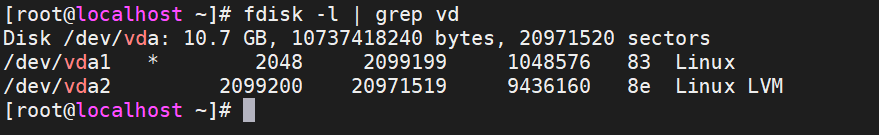

# Thêm Disk, Card vào VM
## Thêm Disk
* Kiểm tra số lượng disk của VM

`fdisk -l | grep vd`



Có 1 disk ảo(2 phân vùng vda1 & vda2) trên VM.

* tắt VM

* Tạo một đĩa ảo trên KVM bằng lệnh `qemu-img`. Ở đây thêm disk có dung lượng 5G lưu tại `/var/lib/libvirt/images`

`qemu-img create -f qcow2 /var/lib/libvirt/images/vmvp-disk2.qcow2 5G`
* Chỉnh sủa lại file xml của VM:

`virsh edit [tên máy ảo]`

* Thêm đoạn như sau và lưu lại
    ```
    <disk type='file' device='disk'>
        <driver name='qemu' type='qcow2'/>
        <source dev='/var/lib/libvirt/images/vmvp-disk2.qcow2'/>
        <target dev='vdb' bus='virtio'/>
    </disk>
    ```
    Trong đó:
    * `<driver name='qemu' type='qcow2'/>`: Tên driver và kiểu disk
    * `<source dev='/var/lib/libvirt/images/vmvp-disk2.qcow2'/>`: Đường dẫn tới disk ảo trên KVM
    * `<target dev='vdb' bus='virtio'/>`: Cần tạo tên khác với tên của disk đang sử dụng là `vda`, ở đây tôi chuyển thành `vdb`
>**Chú ý**: Thay đổi đúng tên disk mới và đường dẫn thư mục của disk
* Define lại file xml của VM

`virsh define /etc/libvirt/qemu/[tên-vm].xml`
* start và kiểm tra disk 