# Thêm Disk, Card vào VM
## Thêm Disk
* Kiểm tra số lượng disk của VM

`fdisk -l | grep vd`


Có 1 disk ảo(2 phân vùng `vda1` & `vda2`) trên VM.

* tắt VM

* Tạo một đĩa ảo trên KVM bằng lệnh `qemu-img`. Ở đây thêm disk có dung lượng 5G lưu tại `/var/lib/libvirt/images`

`qemu-img create -f qcow2 [đường dẫn file disk] [dung lượng disk]`

ví dụ muốn tạo một file disk có dung lượng là 5G:

`qemu-img create -f qcow2 /var/lib/libvirt/images/VMvanphong-1.qcow2 5G`
* Tạo một file XML mới cho VM:

`vi VMvanphong-1.xml`

* Thêm đoạn như sau và lưu lại
    ```
    <disk type='file' device='disk'>
        <driver name='qemu' type='qcow2'/>
        <source dev='/var/lib/libvirt/images/VMvanphong-1.qcow2'/>
        <target dev='vdc' bus='virtio'/>
    </disk>
    ```
    Trong đó:
    * `<driver name='qemu' type='qcow2'/>`: Tên driver và kiểu disk
    * `<source dev='/var/lib/libvirt/images/vmvp-disk2.qcow2'/>`: Đường dẫn tới disk ảo trên KVM
    * `<target dev='vdb' bus='virtio'/>`: Cần tạo tên khác với tên của disk đang sử dụng là `vda`, ở đây tôi chuyển thành `vdb`
>**Chú ý**: Thay đổi đúng tên disk mới và đường dẫn thư mục của disk

* Define lại file xml của VM

`virsh attach-device --config [tên VM] [đường dẫn file xml mới]`

vidu:

* start và kiểm tra disk   

`virsh start [tên VM]`

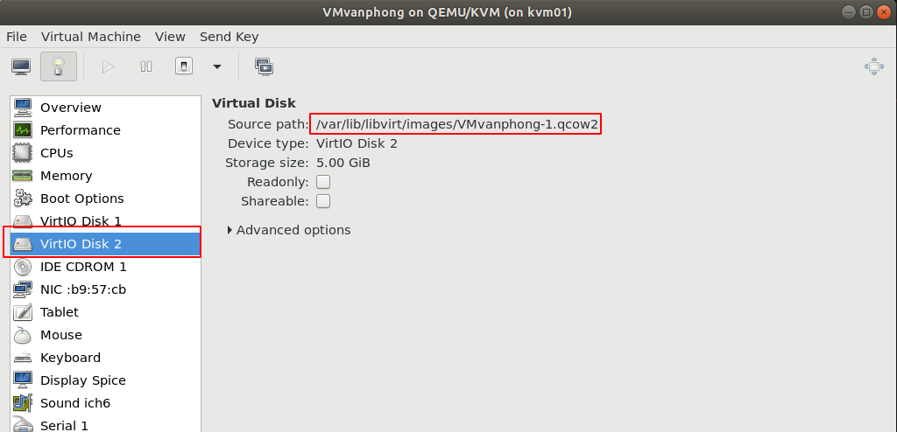

# Phân vùng ổ đĩa 

`fdisk` cho thiết bị mới

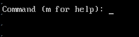

nhấn `n` để tạo phân vùng mới

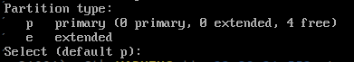

chọn phân vùng `1`

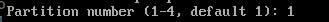

set size

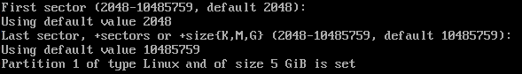

Nhập `t` để định cấu hình phân vùng

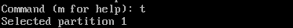

Nhập `83` cho phana vùng của linux

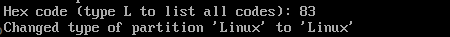

Lưu lại

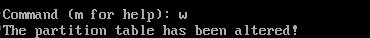


định dạng phân vùng mới với hệ thống tệp ext3 

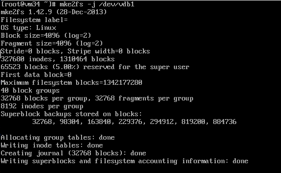

mount file

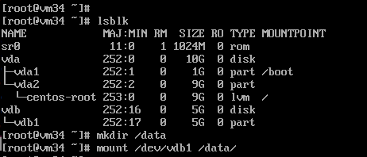

sửa file `fstab`

`echo "/dev/vdb1 /myfile ext3 auto 0 0" /etc/fstab`

## Thêm card mạng cho VM

* Xem card mạng trên VM

`virsh domiflist [tên VM]`

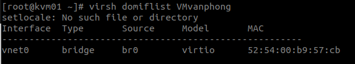

