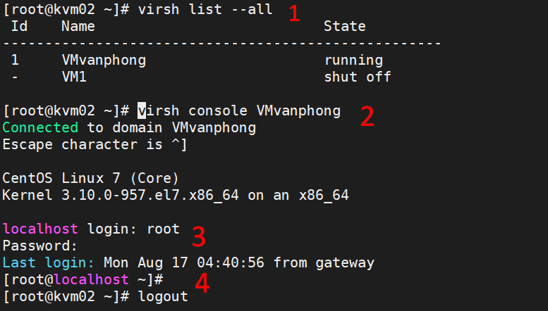

## Truy cập console VM

## Tại máy VM
* Khởi động dịch vụ trên VM

```
systemctl start serial-getty@ttyS0.service
systemctl enable serial-getty@ttyS0.service
```

## Tại máy KVM chứa VM
* Đăng nhập bằng console 
`virsh console [Tên máy VM]`



* **1** Kiểm tra các VM trên KVM
* **2** Truy cập Console 
* **3** Nhập tài khoản và mật khẩu của VM
* **4** Đăng xuất VM khỏi phiên làm việc nhấn tổ hợp phím ***Ctrl*** + ***]***