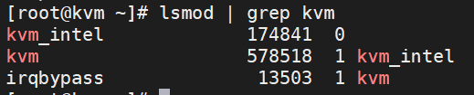

# Cài đặt KVM trên CentOS-7

KVM(Kernel-based Virtual Machine) được biết đến là một cơ sở hạ tầng ảo hóa cho cho nhan Linux dành cho những CPU hỗ trợ công nghệ ảo hóa như Intel VT hoặc AMD-V.

## Chuẩn bị
* Một máy chạy CentOS-7 có hỗ trợ công nghệ ảo hóa: 2CPU, 2GB RAM, 20GB Disk
* File ISO của hệ điều hành để cài lên máy ảo KVM

### Mô hình


Cấu hình đưa ENS33 về IP Static.

### IPPlanning


## Cài đặt KVM

### Kiểm tra hỗ trợ ảo hóa

Để xem máy có hỗ trợ ảo hóa hay không

` egrep -c "svm|vmx" /proc/cpuinfo`

Kết quả:


Nếu máy trả kết là 0, thì máy không hỗ trợ ảo hóa. Còn khác 0 là số nhân CPU có thể làm Ảo hóa.

Nếu VMware, ta phải bật hỗ trợ ảo hóa trong Vitual Machine Setting của máy ảo. Đánh dấu vào 2 ô như hình dưới đây:

[Hdv](../image/Screenshot_16.png)

### Cài đặt các gói cần thiết 

`yum -y install qemu-kvm libvirt virt-install bridge-utils virt-manager`

Trong đó:

* **qemu-kvm**: Phần phụ trợ cho KVM.
* **libvirt**: Cung cấp libvirt mà bạn cần quản lý qemu và KVM bằng Libvirt.
* **Bridge-utils**: Chứa một tiện ích cần thiết để tạo và quản lý các thiết bị bridge
* **virt-manager**: Cung cấp giao diện đồ họa để quản lý máy ảo
* **virt-install**: Cung cấp lệnh để cài đặt máy ảo.

Khi cài đặt hoàn tất, ta kiểm tra các module KVM

`lsmod | grep kvm`

`Lsmod` là câu lệnh dùng để liệt kê các module có thể truy cập vào kernel để thay đổi và không cần phải reset.



### Bật libvirt và khởi động cùng hệ thống

```
systemctl start libvirtd
systemctl enable libvirtd
```

### Tạo một card mạng Brigde

Ta sẽ tạo 1 card Brigde ở chế độ NAT để khi tạo KVM sẽ gắn card mạng vào Bridge này:

```
nmcli connection add type bridge autoconnect yes con-name br0 ifname br0
nmcli connection modify br0 ipv4.addresses 192.168.9.3/24 ipv4.method manual  
nmcli connection modify br0 ipv4.gateway 192.168.9.2
nmcli connection modify br0 ipv4.dns 8.8.8.8  
nmcli connection delete ens33
nmcli connection add type bridge-slave autoconnect yes con-name ens33 ifname ens33 master br0

#restart network
```

Giải thích thống số dòng thêm bridge


nếu ssh bạn phải truy cập vào server và thực hiện câu lệnh tiếp theo do đã xóa thông tin của card Network ens33 


reboot lại hệ thống:

`init 6`

## Sử dụng công cụ virt-manager 
### Download File ISO CentOS-7
Download và lưu file ISO Minimal vào thư mục `/var/lib/libvirt/file-iso/`

```
cd /var/lib/libvirt/
mkdir file-iso
cd file-iso

yum install -y wget
wget http://repos-va.psychz.net/centos/7.6.1810/isos/x86_64/CentOS-7-x86_64-Minimal-1810.iso
```

Đối với bản Minimal thì để sử dụng công cụ đồ họa virt-manager, ta cần cài đặt gói X-Window 

` yum install -y "@X Window System" xorg-x11-xauth xorg-x11-fonts-* xorg-x11-utils`

### Truy cập Virt-manager để cấu hình VM 
* Truy cập Virt-manager:

`virt-manager`

Xuất hiện công cụ bằng GUI


* Tạo máy ảo:


* Chọn kiểu cài đặt hệ điều hành:

Tại đây chọn cài hệ điều hành bằng ISO hoặc CDROM -> **Forward**


* Chọn đường dẫn cho File ISO để cài cho VM


* Cài đặt các thông số phần cứng cơ bản muốn đặt cho máy VM


Thiết lập thông số RAM CPU:


Thiết lập thông số Disk 


* Phần Network selection ta sẽ gắn card mạng vào **bridge** `bro`


Check lại thông tin cho VM


* kiểm tra và thiết lập thống số => **Begin Installation** 


* Sau đó thực hiện thiết lập OS như bình thường:


## Xem danh sách máy ảo và trạng thái các máy ảo KVM

` virsh list --all`

