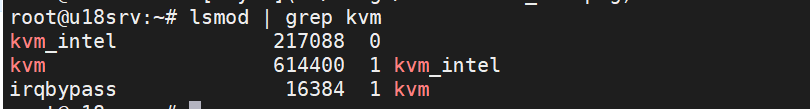

# Hướng dẫn cài KVM trên Ubuntu 18-04

Chuẩn bị cấu hình với ít nhất 2 CPU, 2 GB và Disk.

Máy có card mạng để kết nối mạng cho VM ra ngoài.

Lưu ý: Để cài đặt KVM thì cần phải được CPU hỗ trợ. Để kiểm tra xem Cpu có hỗ trợ hay không sử dụng lệnh.

`egrep -c "svm|vmx" /proc/cpuinfo`

Nếu kết quả trae về là khác 0 thì Cpu có hỗ trợ

## Mỗ hình 

## Cài đặt KVM

Cài đặt KVM và công cụ quản lý `virt-manager`

`sudo apt-get install qemu-kvm libvirt-bin bridge-utils virt-manager`

Trong đó: 
* **qemu-kvm**: Phần phụ trợ cho KVM
* **libvirt-bin**: Cung cấp libvirt mà bạn cần quản lý qemu bằng libvirt
* **bridge-utils**: Chứa tiện ích cần thiết để tạo và quản lý máy ảo.
* **virt-manager**: cung cấp giao diện để quản lý máy ảo.

Kiểm tra xem KVM đã được cài đặt:

`lsmod | grep kvm`

### Tạo linux Bridge cho VM kết nối mạng

* Tạo Linux bridge có tên br0

`sudo nmcli connection add type bridge autoconnect yes con-name br0 ifname br0`

* Add card mạng có tên: **eth0** vào Linux Bridge có tên **br0**

`sudo brctl addif br0 eth0`

* Xóa IP của của card mạng eth0

`ifconfig eth0 0`

* Xin cấp IP cho bridge

`dhclient br0`

