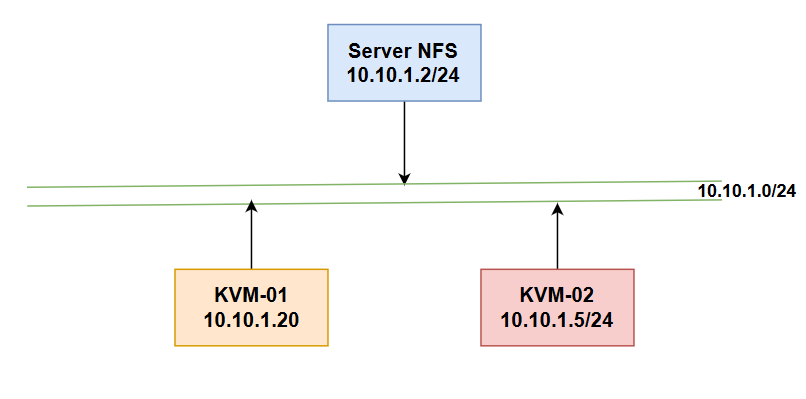
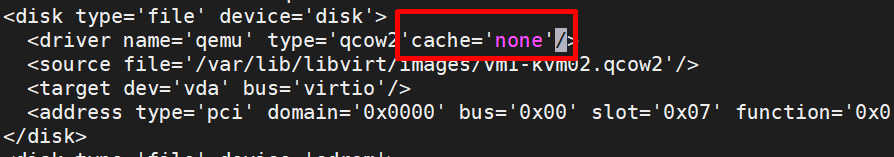
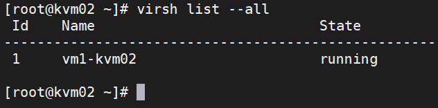
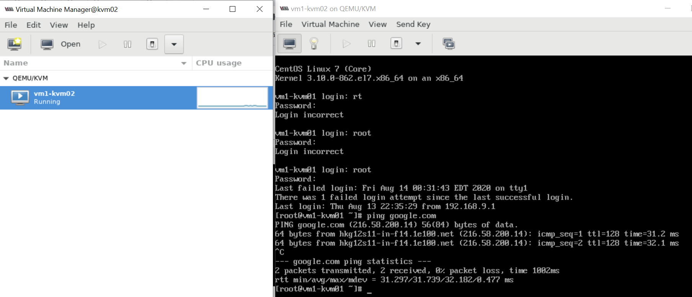
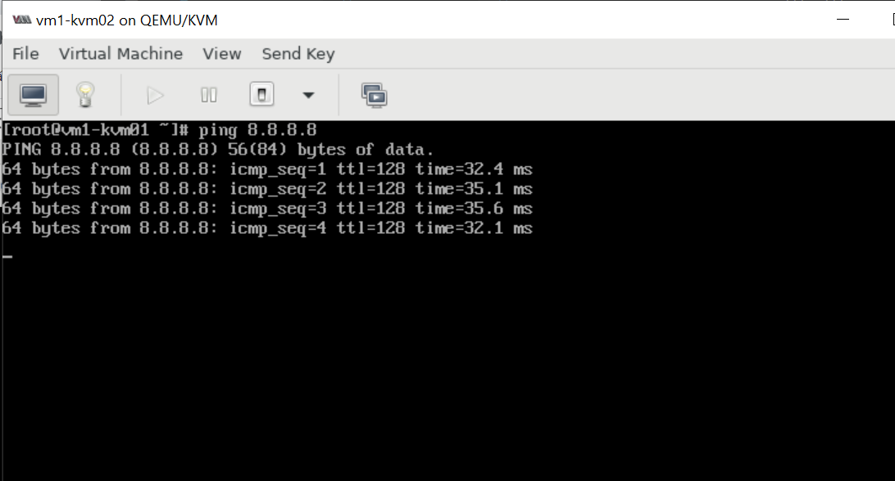
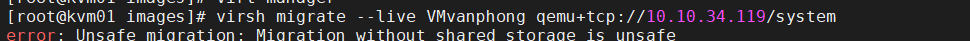
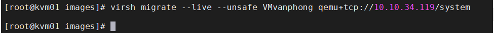

# Live migrate trên KVM
I. [Tổng quan](#tongquan)

II. [Chuẩn bị](#chuanbi)

III. [Điểm nổi bật](#noibat)

IV. [Cài đặt](#caidat) 
1. [Cài đặt NFS](#nfs)
2. [Cài đặt KVM](#kvm)
3. [Kết nối qemu giữa hai KVM host](#qemu)
4. [Migrate](#mig)


<a name="tongquan"></a>
## Tổng quan
Trong quá trình vận hành để phục vụ cho việc bảo trì và nâng cấp hệ thống chúng ta cần chuyển các VM từ host này sang host khác. Với các VM đang chạy các ứng dụng quan trọng chúng ta không thể tắt nó đi trong quá trình di chuyển. Trên KVM việc live migrate sẽ đảm bảo được các yêu cầu này

* Máy 64bit chỉ có thể di chuyển sang máy chủ 64, nhưng máy 32bit có thể di chuyển xang máy bất kỳ.

### Yêu cầu
- Image VM có thể truy cập được trên cả máy chủ nguồn và máy đích
- Máy chủ nguồn và máy chủ đích cùng dải mạng(giữ mạng của khách khi tap được sử dụng)
- Không sử dụng tùy chọn lệnh `-snapshot`
<a name="chuanbi"></a>
## Chuẩn bị

<a name="noibat"></a>
## Điểm nổi bật

* Không gây sự chú ý của khách hàng về down time
* Khả năng chuyển đổi trạng thái VM đường chuyển thông qua một chương trình bên ngoài.
* Khi thành công, khách hàng tiếp tục chạy trên máy chủ đích, khi thất bại, khách tiếp tục chạy trên máy nguồn
* Nhanh và đơn giản
* Độc lập phần cứng
* Hỗ trợ di chuyển máy ảo đã dừng hoặc tạm dừng
* 
### Mô Hình


### Cơ chế cơ bản của Live migrate
Về cơ bản cơ chế di chuyển VM khi VM vẫn đang hoạt động. Quá trình trao đổi diễn ra nhanh các phiên làm việc kết nối hầu như không cảm nhận được sự gián đoạn nào. Quá trình Live Migrate được diễn ra như sau:

* Bước đầu tiên của quá trình Live_Migrate: 1 ảnh chụp ban đầu của VM cần chuyển trên host KVM-01 sang host KVM-02.
* Trong trường hợp người dùng đang truy cập VM tại host KVM-01 thì những sự thay đổi và hoạt động trên KVM-02 vẫn diễn ra bình thường, tuy nhiên những sự thay đổi này sẽ không được ghi nhận.
* Những thay đổi của VM trên Host KVM-01 được đồng bộ liên tục đến host KVM-02
* Khi đã đồng bộ xong thì VM trên host KVM-01 sẽ Offline và các phiên bản truy cập trên host KVM01 được chuyển sang host KVM02

<a name="caidat"></a>
## Cài đặt
### 1.Cấu hình phân giải tên miền 

Để có thể live migrate giữa 2 KVM host thì 2 máy này cần biết tên miền của nhau. Bạn có thể cấu hình dịch vụ DNS phân dải tên miền cho 2 máy này.

Nhưng nếu không có DNS thì cấu hình bằng cách sửa file `/etc/hosts` như sau:

**Trên KVM01**

* Sửa tên máy trong file `/etc/hostname`. 

`echo "kvm01" > /etc/hostname`

* Chỉ ra tên miền và địa chỉ của máy KVM host còn lại trong file `/etc/hosts`. Thực hiện câu lệnh sau

`echo "10.10.1.20 kvm02.local kvm02" >> /etc/hosts`
* Reboot lại máy

`reboot`
**Trên KVM-02**
* Sửa tên máy trong file `/etc/hostname`. 

`echo "kvm02" > /etc/hostname`

* Chỉ ra tên miền và địa chỉ của máy KVM host còn lại trong file `/etc/hosts`. Thực hiện câu lệnh sau

`echo "10.10.1.5 kvm01.local kvm01" >> /etc/hosts`
* Reboot lại máy

`reboot`


<a name="nfs"></a>

### 2.Cài đặt NFS
**Trên NFS Server**
* Cài đặt NFS

`yum install -y nfs-utils nfs-utils-lib`
* Bắt đầu dịch vụ:

`service nfs start`
* Chọn thư mục để làm thư mục share hoặc tạo mới một thư mục. Ở đây tạo 1 thư mục `/root/storage`

`mkdir /root/storage`
* Chia sẻ thư mục này với các máy KVM host bằng cách ghi các thông tin như sau vào file `/etc/exports`

```
/root/storage 10.10.1.5/24(rw,sync,no_root_squash)
/root/storage 10.10.1.20/24(rw,sync,no_root_squash)
```
địa chỉ IP bên trên là địa chỉ IP của 2 máy KVM host.
* Khởi động dịch vụ nfs và rpcbind:

```
systemctl start rpcbind
systemctl start nfs-server
systemctl enable rpcbind
systemctl enable nfs-server
```

* Cập nhật lại file vừa chỉnh sửa

`exportfs -a`
* Mở port cho phép truy cập:

```
firewall-cmd --permanent --add-service=rpc-bind
firewall-cmd --permanent --add-service=mountd
firewall-cmd --permanent --add-port=2049/tcp
firewall-cmd --permanent --add-port=2049/udp
firewall-cmd --reload
```


**Trên KVM Host**
* Cài đặt NFS

`yum install -y nfs-utils nfs-utils-lib`
* Bắt đầu dịch vụ:

`service nfs start`

* Sử dụng thư mục chứa file disk. Ở đây, ta tạo thư mục mới

`mkdir storage`
* Mount thư mục chứa máy ảo với thư mục đã share. Lưu ý: địa chỉ IP của NFS server 

```
mount 10.10.1.2:/root/storage/ /root/storage/
mount /var/lib/libvirt/images/ /root/storage/
hoặc sử dụng thư mục mặc định chứa file disk của VM
```
`mount 10.10.1.2:/root/storage/ /var/lib/libvirt/images/`

Lưu ý: mỗi khi reboot lại máy ta cần mount lại các thư mục này nếu không muốn bạn mount nó bằng file `/etc/fstab`

* Kiểm tra : `mount | grep /storage`
<a name="kvm"></a>

### 3.Cài đặt KVM
Thực hiện cài KVM trên cả 2 máy KVM Host. 

Khi cài đặt VM ta cần lưu file disk của VM vào thư mục đã mount với thư mục được share NFS

Khi cài máy ảo xong ta cần thêm thông tin sau vào trong file xml của VM bằng cách sử dụng lệnh

`virsh edit [tên vm]`

Thêm vào `cache='none'` để trách trường hợp migrate bị mất dữ liệu



Sau đó reboot lại VM.

Các bước này nên thực hiện ngay sau khi cài VM kể cả bạn chưa có ý định live migrate ngay lúc này bởi vì cần migrate có thể thực hiện được luôn mà không cần reboot VM khi đã cài các ứng dụng lên.
<a name="qemu"></a>

### 4.Kết nối qemu giữa hai KVM host
Để có thể Live Migrate giữa hai KVM Host này cần phải kết nối được với nhau. Để làm được việc này ta thực hiện các bước sau ở trên cả hai máy KVM Host.


```
sed -i 's/#listen_tls = 0/listen_tls = 0/g' /etc/libvirt/libvirtd.conf 
sed -i 's/#listen_tcp = 1/listen_tcp = 1/g' /etc/libvirt/libvirtd.conf
sed -i 's/#tcp_port = "16509"/tcp_port = "16509"/g' /etc/libvirt/libvirtd.conf
sed -i 's/#listen_addr = "10.10.34.1"/listen_addr = "0.0.0.0"/g' /etc/libvirt/libvirtd.conf
sed -i 's/#auth_tcp = "sasl"/auth_tcp = "none"/g' /etc/libvirt/libvirtd.conf
sed -i 's/#LIBVIRTD_ARGS="--listen"/LIBVIRTD_ARGS="--listen"/g' /etc/sysconfig/libvirtd
```

Restart lại libvirt trên cả hai máy.

`systemctl restart libvirtd`
<a name="mig"></a>
### 5.Migrate

Ta kiểm tra VM trên KVM-02, và tạo một số file như hình





Trước khi migrate, ta sẽ chạy lệnh ping trên vm1 của KVM02



Migrate từ KVM-02(10.10.1.5) sang KVM-01(10.10.1.20) thực hiện câu lệnh trên KVM-02

`virsh migrate --live  kvm02 qemu+tcp://10.10.1.20/system`



Thêm tùy chọn `--unsafe `

` virsh migrate --live --unsafe VMvanphong qemu+tcp://10.10.34.119/system`



Thực hiện thành công 
