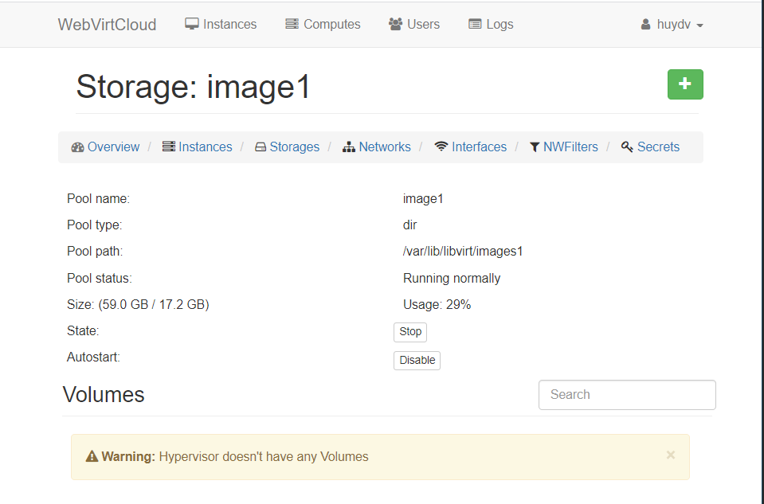
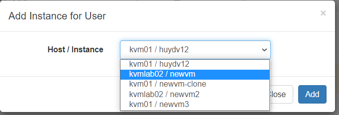
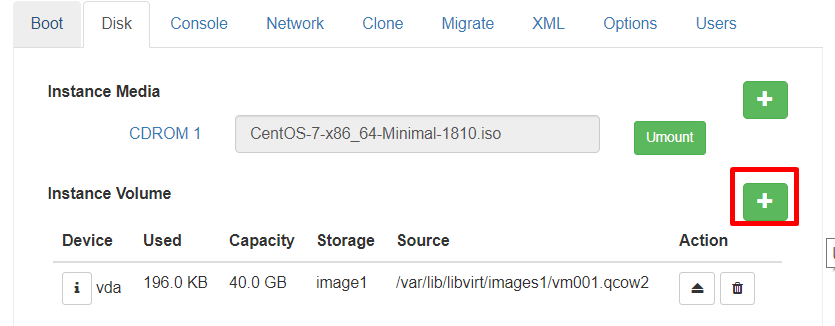
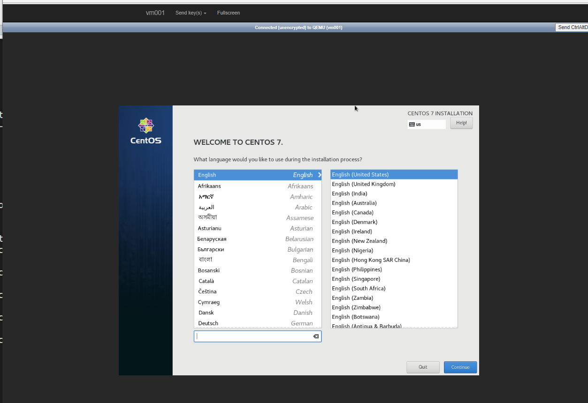

# Hướng dẫn sử dụng WebVirtCloud
## Tạo Storage pool

## Tạo network 

* NAT: Đối với NAT máy có thể ping được ra bên ngoài nhưng bên ngoài không thể ping được tới địa chỉ IP đang sử dụng NAT

## Gắn VM cho User thường
Tạo 1 User thường

Chọn VM:

Add để lưu

Kết quả:

Thay đổi quyền của User:

## Tạo VM
Để tạo được VM user phải có quyền admin

Chọn Cụm KVM:

* Flavor:
Cụm có các cấu hình mặc định của WebVirtCloud:

Điền thông tin cho VM

Tùy chọn boot

Cấu hình Disk, mount file iso

Hoặc có thể add disk có VM tại đây

Điền thông tin disk mới => **Add Volume**

Bật VM

Truy cập Console để cấu hình begin cho VM

Cài đặt như bình thường:

* Custom: tạo VM tùy chọn điền đầy đủ thông tin muốn cài đặt cho VM => **create** 

Tạo các bước tiếp theo làm giống bên trên

## log

Để xem các thao tác của user và admin xem tại **log**

