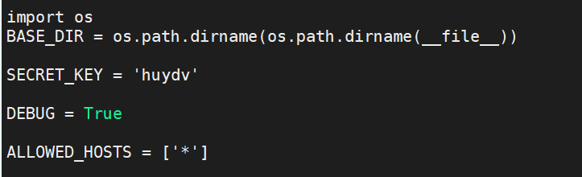
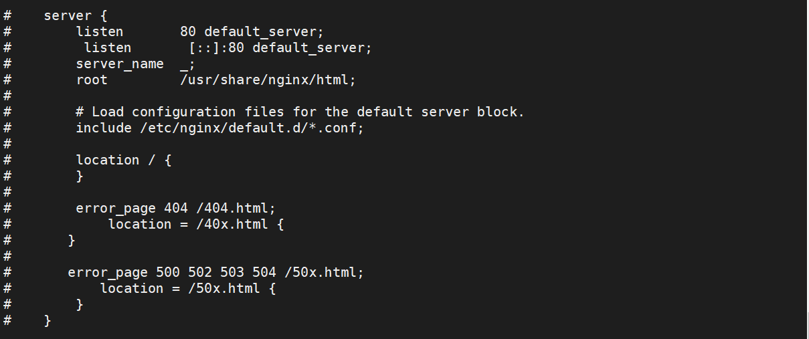
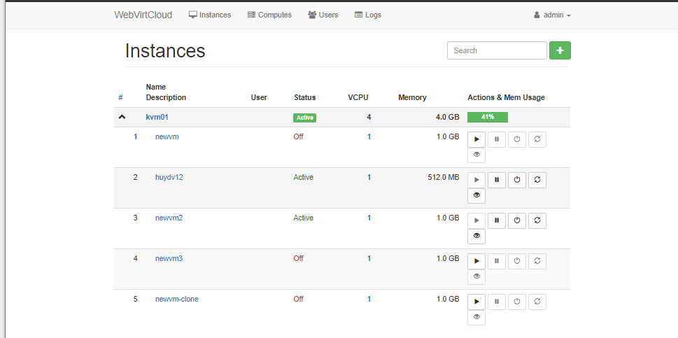
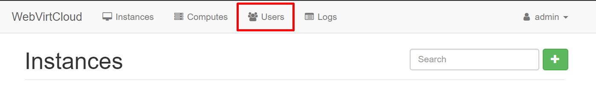
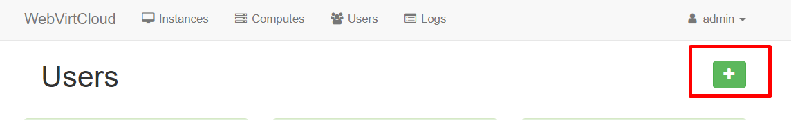
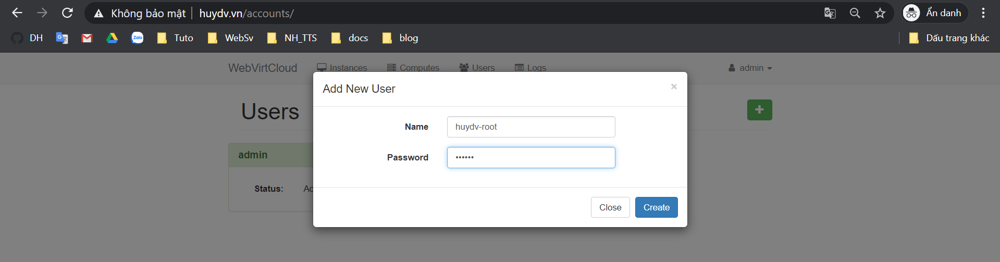
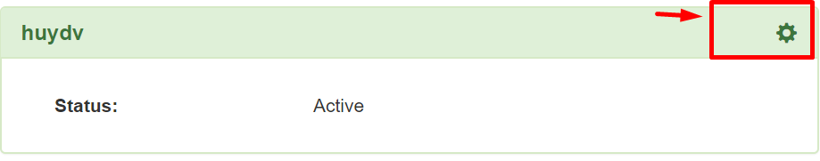
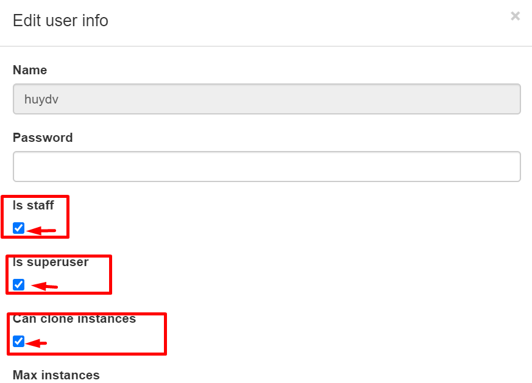
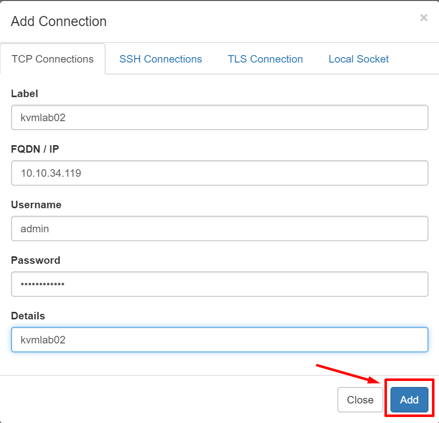
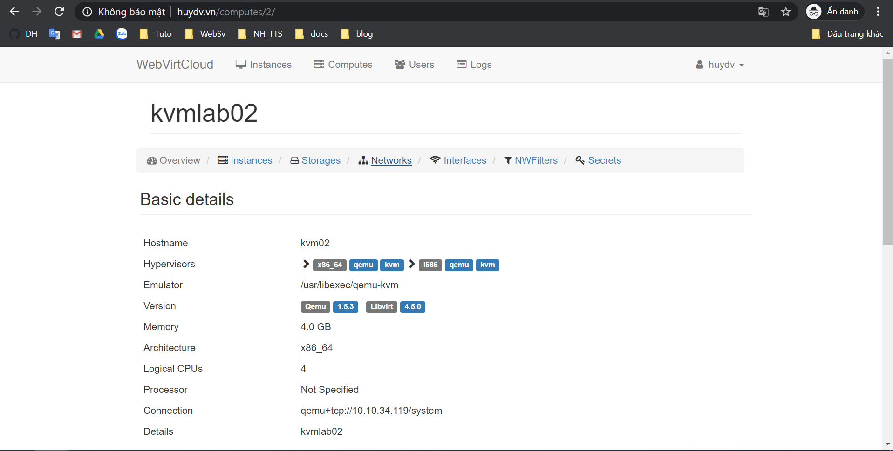

# WebVirtCloud 
* Một công cụ quản lý tập trung hạ tầng KVM hiệu quả, tiện dụng
## Mô Hình

## IPPlanning

## Cài đặt trên KVM

## Cài đặt trên Node Webvirt 

Cài đặt các package cần thiết:

```
yum install epel-release -y
yum -y install python-virtualenv python-devel libvirt-devel glibc gcc nginx supervisor python-lxml git python-libguestfs
```
### Tạo thư mục và clone source code từ trang chủ 
```
cd /srv
git clone https://github.com/retspen/webvirtcloud && cd webvirtcloud
git checkout 1e2fbc8
cp webvirtcloud/settings.py.template webvirtcloud/settings.py
```
### Thay thế secret key
```
cd /srv/webvirtcloud
sed -i 's|SECRET_KEY = ''|SECRET_KEY = 'huydv'|g' webvirtcloud/settings.py
```



### Cài đặt WebVirtCloud
```
cd /srv/webvirtcloud
virtualenv venv
source venv/bin/activate
venv/bin/pip install -r conf/requirements.txt
cp conf/nginx/webvirtcloud.conf /etc/nginx/conf.d/
venv/bin/python manage.py migrate
```

### Cấu hình Supervisor
```
cp /etc/supervisord.conf /etc/supervisord.conf.bk 
cat << EOF >> /etc/supervisord.conf
[program:webvirtcloud]
command=/srv/webvirtcloud/venv/bin/gunicorn webvirtcloud.wsgi:application -c /srv/webvirtcloud/gunicorn.conf.py
directory=/srv/webvirtcloud
user=nginx
autostart=true
autorestart=true
redirect_stderr=true

[program:novncd]
command=/srv/webvirtcloud/venv/bin/python /srv/webvirtcloud/console/novncd
directory=/srv/webvirtcloud
user=nginx
autostart=true
autorestart=true
redirect_stderr=true
EOF
```

### Cấu hình Nginx

`vi /etc/nginx/nginx.conf`

Chú thích lại các dòng lệnh sau:



Chỉnh sửa file `/etc/nginx/conf.d/webvirtcloud.conf`

```
cat << EOF >> /etc/nginx/conf.d/webvirtcloud.conf
upstream gunicorn_server {
    #server unix:/srv/webvirtcloud/venv/wvcloud.socket fail_timeout=0;
    server 127.0.0.1:8000 fail_timeout=0;
}
server {
    listen 80;

    server_name [insert your domain or your IP];
    access_log /var/log/nginx/webvirtcloud-access_log; 

    location /static/ {
        root /srv/webvirtcloud;
        expires max;
    }

    location / {
        proxy_pass http://gunicorn_server;
        proxy_set_header X-Real-IP $remote_addr;
        proxy_set_header X-Forwarded-for $proxy_add_x_forwarded_for;
        proxy_set_header Host $host:$server_port;
        proxy_set_header X-Forwarded-Proto $remote_addr;
        proxy_connect_timeout 600;
        proxy_read_timeout 600;
        proxy_send_timeout 600;
        client_max_body_size 1024M;
    }
}
EOF
```

### Phân quyền cho các thư mục
Phân quyền cho user Nginx có thể đọc được file thư mục chứa code:

`chown -R nginx:nginx /srv/webvirtcloud`

Phân quyền cho selinux

```
yum install policycoreutils-python -y
setenforce 0
semanage fcontext -a -t httpd_sys_content_t "/srv/webvirtcloud(/.*)"

```
### Cấu hình firewall
```
firewall-cmd --permanent --add-port=80/tcp
firewall-cmd --permanent --add-port=6080/tcp
firewall-cmd --reload
```
### Restart vaf enable services
```
systemctl restart nginx && systemctl restart supervisord
systemctl enable nginx && systemctl enable supervisord
```

### Truy cập đến đường dẫn của WebVirtCloud

Login với user mặc định là **admin**/**admin**

Đây là giao diện của webvirtcloud



Thay đổi User:





Tạo user mới





Thêm đầy đủ quyền như user admin




## Add node cho WebVirtCloud


Điền thông tin của KVM và add





